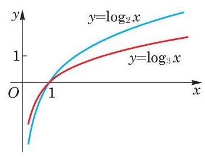
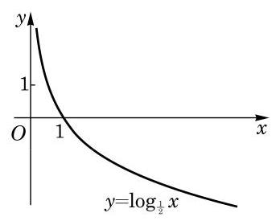

# 例题卡：例 2 分别作出对数函数 $y = {\log }_{2}x$ 及 $y = {\log }_{3}x$ 的大致图像.

例 2 分别作出对数函数 $y = {\log }_{2}x$ 及 $y = {\log }_{3}x$ 的大致图像.

解 先取此图像上的一些特别的点,由 ${\log }_{2}\frac{1}{4} =  - 2$ , ${\log }_{2}\frac{1}{2} =  - 1,{\log }_{2}1 = 0,{\log }_{2}2 = 1,{\log }_{2}4 = 2$ ,所以对数函数 $y = {\log }_{2}x$ 的图像必经过下面的点:

$$
\left( {\frac{1}{4}, - 2}\right) \text{ 、 }\left( {\frac{1}{2}, - 1}\right) \text{ 、 }\left( {1,0}\right) \text{ 、 }\left( {2,1}\right) \text{ 、 }\left( {4,2}\right) .
$$

再使用计算器多采集一些点, 就可以粗略地作出其图像.

因为 ${\log }_{3}\frac{1}{9} =  - 2,{\log }_{3}\frac{1}{3} =  - 1,{\log }_{3}1 = 0,{\log }_{3}3 = 1$ , ${\log }_{3}9 = 2$ ,所以对数函数 $y = {\log }_{3}x$ 的图像必经过点:

$$
\left( {\frac{1}{9}, - 2}\right) \text{ 、 }\left( {\frac{1}{3}, - 1}\right) \text{ 、 }\left( {1,0}\right) \text{ 、 }\left( {3,1}\right) \text{ 、 }\left( {9,2}\right) .
$$

再多采集一些点, 就可以粗略地作出其图像.

我们把这两个图像放在同一个图上以便观察比较, 如图 4-3-1 所示.

