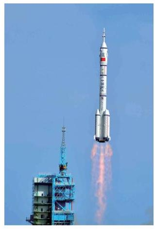

# 例题卡：例 6 试利用对数函数单调性来估算对数 ${\log }_{2}3$ 的第一位小数的值.

例 6 试利用对数函数单调性来估算对数 ${\log }_{2}3$ 的第一位小数的值.

解 因为 ${2}^{1} = 2 < 3 < 4 = {2}^{2}$ ,由对数函数单调性,所以

$$
1 < {\log }_{2}3 < 2\text{ . }
$$

又因为 $9 > 8$ ,即 $3 > 2\sqrt{2} = {2}^{1.5}$ ,再次由对数函数单调性,得

$$
{\log }_{2}3 > {1.5}\text{ . }
$$

现在比较 ${\log }_{2}3$ 与 1.6. 这等价于比较 3 与 ${2}^{1.6} = {2}^{\frac{8}{5}}$ ,即比较 ${3}^{5}$ 与 ${2}^{8}$ . 由于 ${3}^{5} = {243} < {256} = {2}^{8}$ ,因此 $3 < {2}^{1.6}$ . 再由对数函数的单调性, 得

$$
{\log }_{2}3 < {1.6}\text{ . }
$$

最后我们得到

$$
{1.5} < {\log }_{2}3 < {1.6}\text{ . }
$$

因此 ${\log }_{2}3$ 的第一位小数是 5 .

从这个例子可以看出估算对数的更多位精确小数的困难程度.

