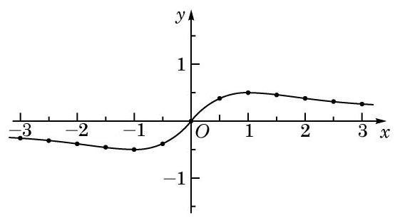
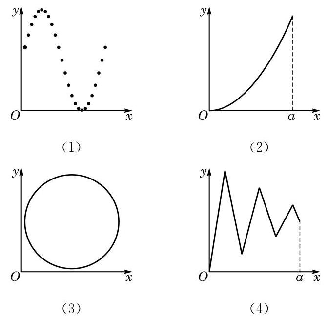
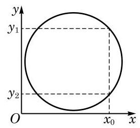
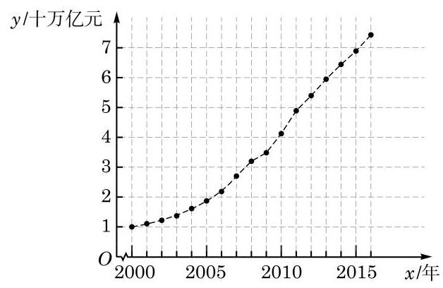
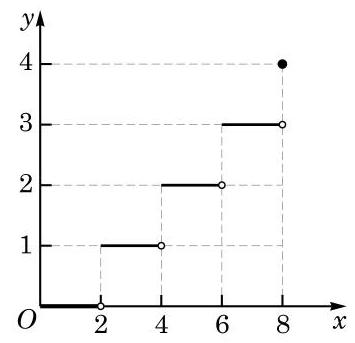

# 方法卡：2 函数的表示方法

用一个数学表达式来表示两个变量之间的对应关系，这种表示函数的方法称为解析法。

例如，$y = 3x + 2, y = x^2 + 2x + 1, y = \sqrt{x^2 + 1} \; (x \in [0, 1]), y = \log_2(2^x - 1)$ 等都是用解析法表示的函数。作自由落体运动的物体的位移 $s$ 与时间 $t$ 满足 $s = \frac{1}{2}gt^2, t \in [0, T]$（$g$ 是重力加速度），也是用解析法来表示的函数。

通过列出自变量的值与对应函数值的相应表格来表达函数关系的方法称为列表法，列表法通常用在定义域为有限集的情况。

例如，表 5-1 列出了国家统计局网站上发布的 2000 年至 2016 年的国内生产总值（GDP）。

**表 5-1** 2000 年至 2016 年中国 GDP 变化表

| 年份 | GDP/亿元 | 年份 | GDP/亿元 |
|------|----------|------|----------|
| 2000 | 100280 | 2009 | 348518 |
| 2001 | 110863 | 2010 | 412119 |
| 2002 | 121717 | 2011 | 487940 |
| 2003 | 137422 | 2012 | 538580 |
| 2004 | 161840 | 2013 | 592963 |
| 2005 | 187319 | 2014 | 641281 |
| 2006 | 219439 | 2015 | 685993 |
| 2007 | 270092 | 2016 | 740061 |
| 2008 | 319245 | | |

注：未包括中国香港、澳门特别行政区和台湾省的地区生产总值数据。

从上表中可以看出，当自变量年份（2000 至 2016 中的整数）确定时，可按照表中所给出的对应关系，查到该年度我国的 GDP 值作为函数值。该函数的定义域为 $\{2000, 2001, 2002, \ldots, 2016\}$，是一个有限集。

我们知道，对于函数 $y = f(x), x \in D$，其定义域 $D$ 中每一个 $x$ 的值都有唯一的一个 $y$ 值与之对应。把这两个对应的数构成的有序实数对 $(x, y)$ 作为点 $P$ 的坐标，记作 $P(x, y)$。所有这些点组成的集合 $G$ 叫做函数 $y = f(x), x \in D$ 的图像（graph），即

$$G = \{ (x, y) \mid y = f(x), x \in D \}.$$

可以看出，如果对定义域 $D$ 中的实数 $x_0$，有 $f(x_0) = y_0$，那么点 $P(x_0, y_0)$ 一定在该函数的图像上；反之，如果点 $P(x_0, y_0)$ 在该函数的图像上，那么必有 $x_0 \in D$，且 $y_0 = f(x_0)$。

常见的一次函数、二次函数、幂函数、指数函数及对数函数的图像，已经在初中和上一章中学过了。

**例 4** 作出函数 $y = \frac{x}{x^2 + 1}$ 的大致图像。

**解** 取自变量 $x$ 的值分别为 -3、$-\frac{5}{2}$、-2、$-\frac{3}{2}$、-1、$-\frac{1}{2}$、$0$、$\frac{1}{2}$、$1$、$\frac{3}{2}$、$2$、$\frac{5}{2}$、$3$，计算出相应的函数值。在平面直角坐标系中标出相应的点，并用光滑的曲线连接这些点，得大致图像如图 5-1-1 所示。

**图 5-1-1**

利用函数的图像来表示函数的方法称为图像法。

**例 5** 以下图形中，哪些是函数的图像，哪些不是？

**图 5-1-2**

---

该函数的图像会出现在第二或第四象限吗？为什么？

需要注意的是，绘制在纸上的或计算机屏幕上的函数图像，终究只是大致的图像，它们无法精确地表示一个函数。但大致的图像能够帮助我们直观地了解函数的性质，从而能更好地发现和研究有关函数的性质。"数形结合"的方法是研究函数的重要方法之一。

---

**解** (1) 这是函数的图像。该函数的定义域是由有限个数构成的集合，定义域中每个自变量的值对应的函数值唯一确定。

(2) 这是函数的图像。该函数的定义域是区间 $[0, a]$，定义域中的每个自变量的值所对应的函数值唯一确定。

(3) 这不是函数的图像。如图 5-1-3，$x_0$ 对应了 $y_1$ 和 $y_2$。

**图 5-1-3**

(4) 这是函数的图像。该函数的定义域是区间 $[0, a]$，定义域中的每个自变量的值所对应的函数值唯一确定。

前文中 2000 年至 2016 年中国国内生产总值（GDP）关于年份的函数，也可以用图像法表示，如图 5-1-4 所示。

**图 5-1-4**

函数图像上所有点的横坐标的集合就是该函数的定义域，而纵坐标的集合就是该函数的值域。

在用解析法表示函数时，有一些函数在不同的区间上可以有不同的表达式。例如，函数 $y = |x|$ 就是通过

$$y = \begin{cases} x, & x \geq 0, \\ -x, & x < 0 \end{cases}$$

来定义的。这样表示函数的方法叫做分段表示法。

**例 6** 某车辆装配车间每 2 h 装配完成一辆车。按照计划，该车间今天生产 8 h。用解析法和图像法分别表示从当天开始生产的时刻起所经过的时间 $x$（单位：h）与装配完成的车辆数 $y$（单位：辆）之间的函数 $y = f(x)$。

**解** 由题意，当 $x \in [0, 2)$ 时，$y = 0$；当 $x \in [2, 4)$ 时，$y = 1$；当 $x \in [4, 6)$ 时，$y = 2$；当 $x \in [6, 8)$ 时，$y = 3$；当 $x = 8$ 时，$y = 4$。

---

在检验平面直角坐标系中的一个图形是否为函数的图像时，需要注意该图形反映的对应关系是否符合函数的定义，即定义域中的每一个 $x$ 的值是否对应到唯一的一个 $y$ 的值。

分段表示法也是一种解析法。用分段表示法表示一个函数时，其定义域就是每一部分中自变量的取值范围的并集。

---

可以用如下的分段表示法表示 $y$ 与 $x$ 之间的函数关系：

$$y = \begin{cases} 0, & 0 \leq x < 2, \\ 1, & 2 \leq x < 4, \\ 2, & 4 \leq x < 6, \\ 3, & 6 \leq x < 8, \\ 4, & x = 8. \end{cases}$$

该函数的大致图像如图 5-1-5 所示。

**图 5-1-5**

---

不大于 $x$ 的最大整数，称为实数 $x$ 的整数部分。

---

数学上，常用 $[x]$ 表示不大于 $x$ 的最大整数。注意到当 $2k \leq x < 2k + 2 (k \in \mathbf{Z})$ 时，$k \leq \frac{x}{2} < k + 1$，从而 $[\frac{x}{2}] = k$。使用此符号，例 6 中的函数可以简洁地表示为 $y = [\frac{x}{2}], x \in [0, 8]$。
