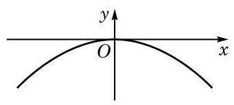
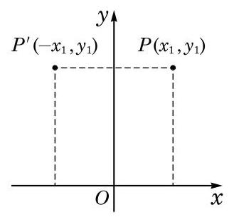

# 概念卡：1 函数的奇偶性

在生活中，我们经常遇到对称的图形。拱桥的桥面形成的弧，就可以视为是轴对称的。如果把桥面抽象成一条曲线，以曲线的最高点为原点，过原点作一水平直线为 $x$ 轴，再过原点作一竖直直线为 $y$ 轴，那么这条由拱桥桥面抽象出的曲线就成为一个函数的图像，并且该图像的一个特点是关于 $y$ 轴成轴对称，如图 5-2-1 所示。

**图 5-2-1**

在学习二次函数和幂函数时，我们知道，形如 $y = ax^2 + c \; (a \neq 0)$ 的二次函数和幂函数 $y = x^{-\frac{2}{3}}$ 的图像都是关于 $y$ 轴成轴对称的，如图 5-2-2 所示。

**图 5-2-2**

---

图 5-2-2 中的这两个函数的图像都具有关于 $y$ 轴成轴对称的共同特征，其相应的自变量与函数值的对应关系是如何体现这个特征的？

---

一个图形关于某条直线 $l$ 成轴对称，是指该图形上的任意一点关于直线 $l$ 的对称点也在此图形上。

现在，我们来探究"函数的图像关于 $y$ 轴成轴对称"这一条件的等价表达形式。

在函数 $y = f(x), x \in D$ 的图像 $G$ 上任取一点 $P(x_1, y_1)$，就有

$$x_1 \in D \text{，并且 } y_1 = f(x_1) \text{。}$$

**图 5-2-3**

点 $P(x_1, y_1)$ 关于 $y$ 轴的对称点为 $P'(-x_1, y_1)$（图 5-2-3）。如果函数 $y = f(x), x \in D$ 的图像关于 $y$ 轴成轴对称，那么 $P'(-x_1, y_1)$ 也在图像 $G$ 上，即

$$-x_1 \in D \text{，并且 } y_1 = f(-x_1) \text{。}$$

这说明，如果函数 $y = f(x), x \in D$ 的图像关于 $y$ 轴成轴对称，那么对于任意给定的 $x \in D$，均有

$$-x \in D \text{，并且 } f(x) = f(-x) \text{。}$$

反之，如果对于任意给定的 $x \in D$，均有 $-x \in D$，并且 $f(x) = f(-x)$，那么对于函数 $y = f(x), x \in D$ 的图像上的任一点 $Q(x_2, y_2)$，它关于 $y$ 轴的对称点 $Q'(-x_2, y_2)$，由于满足 $-x_2 \in D$，并且 $y_2 = f(-x_2)$，也必在此函数的图像上。因此，该函数的图像关于 $y$ 轴成轴对称。

总结一下，就得到下述关于偶函数的定义：

**定义** 对于函数 $y = f(x)$，如果对于其定义域 $D$ 中任意给定的实数 $x$，都有 $-x \in D$，并且

$$f(-x) = f(x),$$

就称函数 $y = f(x)$ 为偶函数（even function）。

根据上述推导及定义，从图形的角度来看，偶函数就是其图像关于 $y$ 轴成轴对称的函数。

根据上述性质，如果要得到偶函数 $y = f(x)$ 的图像，只需要获得其在定义域中 $x \geq 0$（或 $x \leq 0$）部分的图像就可以了。同理，如果要研究偶函数的性质，也只要研究其在定义域中 $x \geq 0$（或 $x \leq 0$）部分的性质就可以了。

**例 1** 证明：函数 $y = 2x^4 - 3x^2$ 是一个偶函数。

**证明** 函数 $y = 2x^4 - 3x^2$ 的定义域为 $\mathbf{R}$。

记 $f(x) = 2x^4 - 3x^2$。在 $\mathbf{R}$ 中任取一个实数 $x$，都有 $-x \in \mathbf{R}$，并且

$$f(-x) = 2(-x)^4 - 3(-x)^2 = 2x^4 - 3x^2 = f(x)。$$

因此，$y = 2x^4 - 3x^2$ 是一个偶函数。

除了轴对称外，中心对称也是平面上非常重要的一类对称关系。一个图形关于某个点 $P$ 成中心对称，是指该图形上的任意一点关于点 $P$ 的对称点也在此图形上。

函数 $y = x^3$ 的图像就关于原点成中心对称。相应地，类似于偶函数，我们把满足以下条件的函数称为奇函数。

**定义** 对于函数 $y = f(x)$，如果对于其定义域 $D$ 中的任意给定的实数 $x$，都有 $-x \in D$，并且

$$f(-x) = -f(x)，$$

就称函数 $y = f(x)$ 为奇函数（odd function）。

类似于偶函数图像性质的推导，可以知道，奇函数就是图像关于原点成中心对称的函数。并且，已知奇函数在其定义域中 $x \geq 0$（或 $x \leq 0$）部分的图像（或性质），可以推导出其另一部分的图像（或性质）。

---

根据奇函数的图像特征，你能从已学的函数（如一次函数、幂函数）中举出几个奇函数的例子吗？

---

**例 2** 证明：$y = x^3 - \frac{1}{x}$ 是一个奇函数。

**证明** 函数 $y = x^3 - \frac{1}{x}$ 的定义域为 $D = \{ x \mid x \neq 0 \}$。

记 $f(x) = x^3 - \frac{1}{x}$。在 $D$ 中任取一个实数 $x$，都有 $-x \neq 0$，因此 $-x \in D$，并且

$$f(-x) = (-x)^3 - \frac{1}{-x} = -(x^3 - \frac{1}{x}) = -f(x)。$$

因此，$y = x^3 - \frac{1}{x}$ 是一个奇函数。

**例 3** 是否存在定义在 $\mathbf{R}$ 上的，且既是奇函数又是偶函数的函数？若存在，求出所有满足此条件的函数；若不存在，说明理由。

**解** 这样的函数是存在的，函数 $y = 0, x \in \mathbf{R}$ 就是一个满足这些条件的函数。

设满足这些条件的函数为 $y = f(x)$。对任一给定的实数 $x_0$，因该函数是奇函数，故 $f(-x_0) = -f(x_0)$；另一方面，因该函数是偶函数，故 $f(-x_0) = f(x_0)$。因此 $f(x_0) = -f(x_0)$，即 $f(x_0) = 0$。所以这样的函数只有一个，即 $y = 0, x \in \mathbf{R}$。
