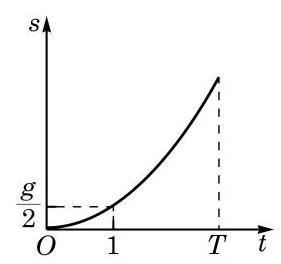

# 方法卡：2 函数的单调性

在现实生活中，有不少在一定范围内随着时间的增加而增加（或减少）的量，如自由落体运动的位移 $s = \frac{1}{2}gt^2, t \in [0, T]$ 就是如此。作出位移 $s$ 关于时间 $t$ 的函数图像，如图 5-2-4 所示。从图像上看，随着时间的增大，位移的确随之增大。这就是一种单调现象。此外，通过一个电阻的电流随其两端电压的增大而增大；许多物质在水中的溶解度随温度的升高而增加；山区的气温随海拔高度的升高而降低等，都是单调现象。

**图 5-2-4**

在学习指数函数及对数函数时，我们已经了解到如下的事实：

当 $a > 1$ 时，函数 $y = a^x$ 与函数 $y = \log_a x$ 的图像都表现出"$y$ 随 $x$ 的增大而增大"的趋势；而当 $0 < a < 1$ 时，函数 $y = a^x$ 与函数 $y = \log_a x$ 的图像却都表现出"$y$ 随 $x$ 的增大而减小"的趋势。

图像上这样的趋势在函数性质的研究中被称为单调性，它是函数重要的性质之一。借助于单调性，就能够更好地掌握函数值的变化规律。

借助指数和对数运算的性质，必修课程第 4 章中已经证明了，若 $x_1 > x_2$，当 $a > 1$ 时，$a^{x_1} > a^{x_2}$ 及 $\log_a x_1 > \log_a x_2$；而当 $0 < a < 1$ 时，$a^{x_1} < a^{x_2}$ 及 $\log_a x_1 < \log_a x_2$。这样，我们就解释了为何这些函数的图像会表现出相应的单调性趋势。概括起来，可对一般函数给出其单调性的定义。

**定义** 对于定义在 $D$ 上的函数 $y = f(x)$，设区间 $I$ 是 $D$ 的一个子集。对于区间 $I$ 上的任意给定的两个自变量的值 $x_1$、$x_2$，当 $x_1 < x_2$ 时，如果总有

$$f(x_1) \leq f(x_2)，$$

就称函数 $y = f(x)$ 在区间 $I$ 上是增函数（increasing function）；而如果总有

$$f(x_1) \geq f(x_2)，$$

就称函数 $y = f(x)$ 在区间 $I$ 上是减函数（decreasing function）。

特别地，如果总有

$$f(x_1) < f(x_2)，$$

就称函数 $y = f(x)$ 在区间 $I$ 上是严格增函数（strictly increasing function）；而如果总有

$$f(x_1) > f(x_2)，$$

就称函数 $y = f(x)$ 在区间 $I$ 上是严格减函数（strictly decreasing function）。

"严格增""严格减""增"及"减"统称为函数的单调性。

例如，$y = 2x$ 在区间 $(-\infty, +\infty)$ 上是严格增函数；$y = x^2$ 在区间 $(-\infty, 0]$ 上是严格减函数，在区间 $[0, +\infty)$ 上是严格增函数；$y = \log_2 x$ 在区间 $(0, +\infty)$ 上是严格增函数；等等。

根据已经学习过的实数幂的性质，对于幂函数 $y = x^r$，当 $r > 0$ 时，该函数在区间 $(0, +\infty)$ 上是严格增函数；而当 $r < 0$ 时，该函数在区间 $(0, +\infty)$ 上是严格减函数。

根据指数及对数的运算性质，当 $a > 1$ 时，$y = a^x$ 在区间 $(-\infty, +\infty)$ 上是严格增函数，$y = \log_a x$ 在区间 $(0, +\infty)$ 上是严格增函数；而当 $0 < a < 1$ 时，$y = a^x$ 在区间 $(-\infty, +\infty)$ 上是严格减函数，$y = \log_a x$ 在区间 $(0, +\infty)$ 上是严格减函数。

---

根据定义，严格增函数是增函数，严格减函数是减函数。

你能用定义证明初中学过的一次函数和反比例函数的单调性吗？

---

**例 7** 证明：函数 $y = x^2 - 2x$ 在区间 $(-\infty, 1]$ 上是严格减函数。

**证明** 记 $f(x) = x^2 - 2x$。设 $x_1$、$x_2$ 是区间 $(-\infty, 1]$ 上任意给定的两个实数，且 $x_1 < x_2$，我们有

$$f(x_1) = x_1^2 - 2x_1, f(x_2) = x_2^2 - 2x_2。$$

由于

$$f(x_1) - f(x_2) = (x_1^2 - 2x_1) - (x_2^2 - 2x_2)$$

$$= (x_1^2 - x_2^2) - 2(x_1 - x_2)$$

$$= (x_1 - x_2)(x_1 + x_2 - 2)，$$

又 $x_1 - x_2 < 0$，且 $x_1 + x_2 - 2 < 1 + 1 - 2 = 0$，故

$$f(x_1) - f(x_2) > 0，$$

即 $f(x_1) > f(x_2)$。

因此，函数 $y = x^2 - 2x$ 在区间 $(-\infty, 1]$ 上是严格减函数。

对于一般的二次函数 $y = f(x)$，其中 $f(x) = ax^2 + bx + c \; (a \neq 0)$，通过配方法，得到

$$f(x) = a(x + \frac{b}{2a})^2 + \frac{4ac - b^2}{4a}。$$

因此，点 $(-\frac{b}{2a}, \frac{4ac - b^2}{4a})$ 被称为该二次函数的图像的顶点，它是相应曲线（抛物线）的最高点或最低点。

先考察 $a > 0$ 的情形。设 $x_1$、$x_2$ 是任意给定的两个实数，且 $x_1 < x_2$，我们有 $f(x_1) - f(x_2) = a(x_1 - x_2)[(x_1 + x_2) + \frac{b}{a}]$。当 $x_1 < x_2 \leq -\frac{b}{2a}$ 时，由 $x_1 - x_2 < 0$ 以及 $x_1 + x_2 + \frac{b}{a} < 0$，可得 $f(x_1) > f(x_2)$；而当 $-\frac{b}{2a} \leq x_1 < x_2$ 时，由 $x_1 - x_2 < 0$ 以及 $x_1 + x_2 + \frac{b}{a} > 0$，可得 $f(x_1) < f(x_2)$。

因此，当 $a > 0$ 时，函数 $y = ax^2 + bx + c$ 在区间 $(-\infty, -\frac{b}{2a}]$ 上是严格减函数，在区间 $[-\frac{b}{2a}, +\infty)$ 上是严格增函数。

类似地，当 $a < 0$ 时，函数 $y = ax^2 + bx + c$ 在区间 $(-\infty, -\frac{b}{2a}]$ 上是严格增函数，在区间 $[-\frac{b}{2a}, +\infty)$ 上是严格减函数。

由上述二次函数的单调性可知，二次函数图像的上升与下降的趋势恰好以它对应的抛物线的顶点为分界点。

**例 8** 判断函数 $y = \log_2(3x + 2)$ 在其定义域上的单调性，并说明理由。

**解** 设 $x_1$、$x_2$ 是定义域 $D = \{ x \mid 3x + 2 > 0 \}$ 上任意给定的两个实数，且 $x_1 < x_2$，易知 $0 < 3x_1 + 2 < 3x_2 + 2$。因为函数 $y = \log_2 x$ 在区间 $(0, +\infty)$ 上是严格增函数，所以 $\log_2(3x_1 + 2) < \log_2(3x_2 + 2)$。

因此，$y = \log_2(3x + 2)$ 在其定义域上是严格增函数。
