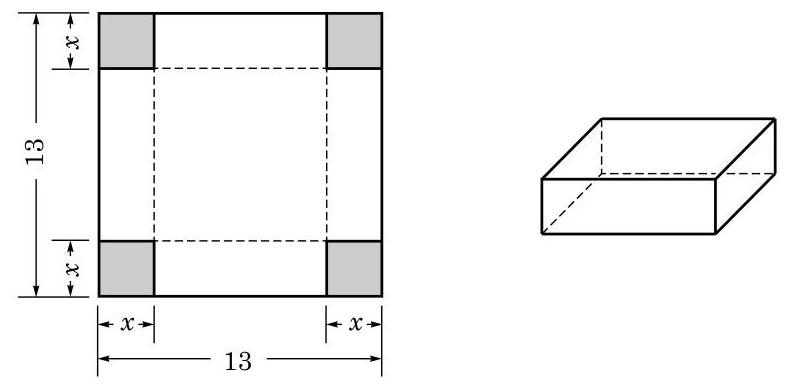

# 定理卡：3 用二分法求函数的零点

在建立了函数关系后，常常会遇到一些解方程的问题。如果相应的函数是一次函数或者二次函数，就可以用已经学习过的求根公式来求解。但是遇到一些更复杂的函数，相应的方程如何求解呢？此时，要求得问题的精确解答，通常是做不到的，而基于实际问题的需要，往往只要求得具有足够精度的近似解就可以了。本课我们将利用上一节课的思想，将求方程的近似解的问题转化为求函数的近似零点的问题，再利用函数的性质来求得方程的近似解。

我们来看一个例子：在一块边长为 $13 \mathrm{cm}$ 的正方形金属薄片的四个角上都剪去一个边长为 $x \mathrm{cm}$ 的小正方形，做成一个容积是 $140 \mathrm{cm}^3$ 的无盖长方体盒子，如图 5-3-8 所示（图中单位：cm）。问：$x$ 是多少？（结果精确到 $0.1 \mathrm{cm}$）

**图 5-3-8**

根据要求，得 $x(13 - 2x)^2 = 140$，我们的目标就是求该方程在区间 $(0, \frac{13}{2})$ 上的实根。

令 $f(x) = x(13 - 2x)^2 - 140, 0 < x < \frac{13}{2}$。上述方程的实根就是函数 $y = f(x)$ 的零点，先用描点法作出该函数的大致图像如下：

**图 5-3-9**

从图像上可以看出，函数 $y = f(x)$ 在区间 $(1, 2)$ 和区间 $(3, 4)$ 上各有一个零点。

**定理** 如果在区间 $[a, b]$ 上，函数 $y = f(x)$ 的图像是一段连续曲线，并且 $f(a) \cdot f(b) < 0$，那么 $y = f(x)$ 在区间 $(a, b)$ 上一定有零点。

下面用二分法寻求该函数在区间 $(3, 4)$ 上的零点的近似值。

二分法的思想非常直接和简单：在确定了区间 $(a, b)$ 上一定有零点的前提下，将区间一分为二，这两部分中总有一个含有零点，而含有零点的区间的长度变为原先的一半。反复执行这种"一分为二"的操作，就能将零点限制在一个足够小的区间中，从而容易求得其近似值了。

因为 $f(3) = 7 > 0, f(4) = -40 < 0$，所以此函数 $y = f(x)$ 在区间 $(3, 4)$ 上至少有一个有零点。

取 $(3, 4)$ 的中点 $x_1 = \frac{3 + 4}{2} = 3.5$，计算可得 $f(3.5) = -14 < 0$。因为 $f(3) \cdot f(3.5) < 0$，所以 $y = f(x)$ 在区间 $(3, 3.5)$ 上一定有零点。

将这一步骤重复若干次，见表 5-3：

**表 5-3** 用二分法求函数零点的一个例子

| 步骤 | $L$（左端点） | $M$（中点） | $R$（右端点） | $f(L)$ | $f(M)$ | $f(R)$ |
|------|--------------|------------|--------------|--------|--------|--------|
| 1 | 3 | 3.5 | 4 | + | - | - |
| 2 | 3 | 3.25 | 3.5 | + | - | - |
| 3 | 3 | 3.125 | 3.25 | + | + | - |
| 4 | 3.125 | 3.1875 | 3.25 | + | - | - |
| 5 | 3.125 | 3.15625 | 3.1875 | + | + | - |

注意到区间 (3.15625, 3.1875) 中的所有数精确到 0.1 时的近似值都是 3.2，所以 $y = f(x)$ 在区间 $(3, 4)$ 上零点的近似值是 3.2。

按同样的操作方法，可以求得 $y = f(x)$ 在区间 $(1, 2)$ 上的零点近似值是 1.3。

综上所述，上述问题中所剪去的小正方形的边长约是 $1.3 \mathrm{cm}$ 或 $3.2 \mathrm{cm}$。

可以看到，在二分法的实际操作中，从第二步起，每一步只需要计算一个函数值，并判断它的符号，同时，所考虑的区间长度减半。

---

我们学过的一次函数、二次函数、反比例函数、幂函数、指数函数、对数函数以及必修课程第 7 章将要学习的三角函数等，在包含于定义域的任一区间上，图像都是连续的曲线。

---

二分法的这些步骤中，每一步都是明确的。尽管每一步的计算可能不一定简单，而且可能需要重复较多的步骤才能得到具有足够精度的零点近似值，但根据这一算法不断重复同一类计算的特点，可利用计算机强大的计算功能，通过编制计算机程序，很高效地求出零点的近似值。

---

有兴趣的同学可以设计一个二分法求函数零点的程序。

---
