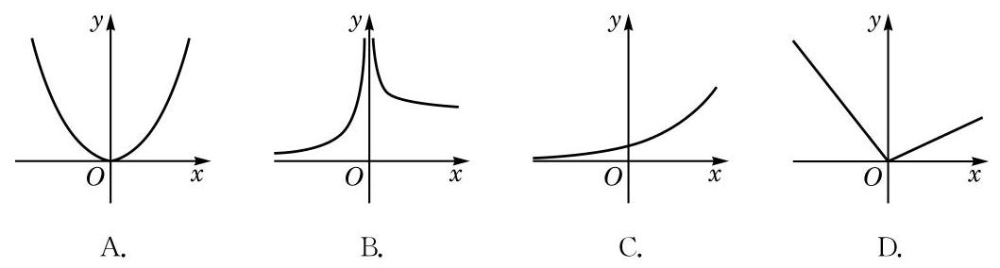

# 练习卡：练习 5.4(2)

1. 定义在 $\mathbf{R}$ 上的偶函数存在反函数吗？说明理由。

2. 下列各图中，存在反函数的函数 $y = f(x)$ 的图像只可能是（）

**(第 2 题)**

3. 已知函数 $y = f(x), x \in D$ 存在反函数 $y = f^{-1}(x), x \in f(D)$。函数 $y = f(x + 1)$ 与 $y = f^{-1}(x + 1)$ 是否一定互为反函数？说明理由。
