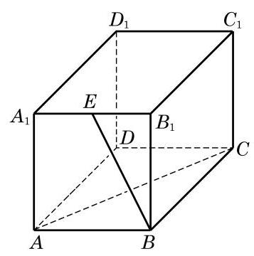
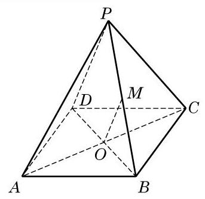
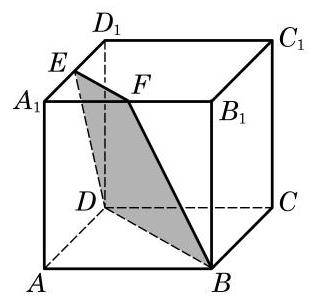
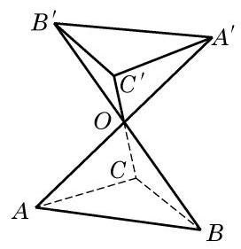
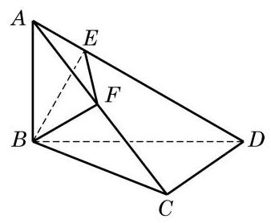
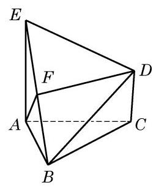
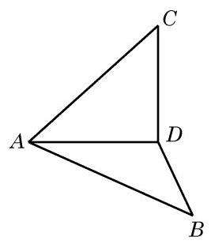
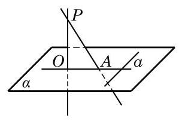
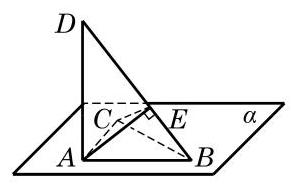

# 概念卡：A 组

(第 1 题)

1. 如图，在长方体 ${ABCD} - {A}_{1}{B}_{1}{C}_{1}{D}_{1}$ 中， $E$ 为 ${A}_{1}{B}_{1}$ 的中点， ${AB} = {B{B}_{1}} = 2,{AC} = {2\sqrt{5}}$ . 求异面直线 ${BE}$ 与 ${AC}$ 所成角的大小.

2. 如图,设 $P$ 为矩形 ${ABCD}$ 所在平面外的一点,矩形对角线的交点为 $O, M$ 为 ${PB}$ 的中点. 判断下列结论是否正确,并说明理由:

(1) OM // PD ;

(2) OM // 平面 PCD ;

(3) OM //平面 ${PDA}$ ；

(4) OM //平面 ${PBA}$ ；

(5) OM // 平面 ${PBC}$ .

(第 2 题)

(第 3 题)

3. 如图,正方体的棱长是 $a$ ,点 $E\text{ 、 }F$ 分别是两条棱的中点.

(1)求证:四边形 BDEF(图中阴影部分)是一个梯形；

(2)求四边形 BDEF 的面积.

4. 判断下列命题的真假, 并说明理由:

(1)若直线 $l$ 与平面 $M$ 斜交，则 $M$ 内不存在与 $l$ 垂直的直线；

(2)若直线 $l$ 上平面 $M$ ，则 $M$ 内不存在与 $l$ 不垂直的直线；

(3)若直线 $l$ 与平面 $M$ 斜交，则 $M$ 内不存在与 $l$ 平行的直线；

(4)若直线 $l//$ 平面 $M$ ，则 $M$ 内不存在与 $l$ 不平行的直线.

5. 如果不在平面上的一条直线上有两点到这个平面的距离相等, 那么这条直线和这个平面有什么位置关系? 画示意图表示.

6. 如图,直线 $A{A}^{\prime }\text{ 、 }B{B}^{\prime }\text{ 、 }C{C}^{\prime }$ 相交于点 $O$ ,且 ${AO} = {A}^{\prime }O,{BO} = {B}^{\prime }O,{CO} = {C}^{\prime }O$ . 求证: 平面 ${ABC}//$ 平面 ${A}^{\prime }{B}^{\prime }{C}^{\prime }$ .

(第 6 题)

(第 8 题)

7. 已知直线 $l\bot$ 平面 $\alpha$ ,直线 $m \subset$ 平面 $\beta$ ,判断下列命题的真假,并说明理由:

(1)若 $\alpha //\beta$ ，则 $l\bot m$ ；

(2)若 $\alpha \bot \beta$ ，则 $l//m$ ；

(3)若 $l//m$ ，则 $\alpha \bot \beta$ ；

(4)若 $l\bot m$ ，则 $\alpha //\beta$ .

8. 如图,已知线段 ${AB}$ 垂直于三角形 ${BCD}$ 所在的平面,且 ${AB} = {BC} = {CD} = 1$ , $\angle {BCD} = {90}^{ \circ  }$ . ${BE} \bot  {AD}$ , $E$ 为垂足, $F$ 为 ${AC}$ 的中点. 求 ${EF}$ 的长.

9. 设正六边形 ${ABCDEF}$ 的边长为 $a$ ,线段 ${PA}$ 垂直于正六边形所在的平面,且 ${PA} \; = {2a}$ . 分别求点 $P$ 到 ${CD}\text{ 、 }{DE}$ 与 ${BC}$ 所在直线的距离.

##### B 组

1. 已知直线 $a\text{ 、 }b$ 和平面 $\alpha \text{ 、 }\beta$ ,判断下列命题的真假,并说明理由:

(1)若 $a//\alpha$ ， $b\bot a$ ，则 $b\bot \alpha$ ；

(2)若 $a//\alpha$ ， $\alpha \bot \beta$ ，则 $a\bot \beta$ ；

(3)若 $a//b$ ， $b \subset  \alpha$ ，则 $a//\alpha$ .

2. 证明: 如果平面 $\alpha$ 和不在这个平面上的直线 $a$ 都垂直于平面 $\beta$ ,那么直线 $a$ 必平行于平面 $\alpha$ .

3. 三个平面两两相交, 得到三条交线. 求证: 这三条交线交于一点或两两平行.

4. 如图,已知 $\bigtriangleup  {ABC}$ 是正三角形， ${EA}$ 、 ${CD}$ 都垂直于平面 ${ABC}$ ，且 ${EA} = {AB} = {2a}$ ， ${DC} = a, F$ 是 ${BE}$ 的中点.

(1)求证: ${FD}//$ 平面 ${ABC}$ ；

(2)求证: ${AF}\bot$ 平面 ${EDB}$ .

(第 4 题)

(第 6 题)

5. 证明: 如果一个平面的一条平行线垂直于另一个平面, 那么这两个平面互相垂直.

6. 如图,以等腰直角三角形 ${ABC}$ 斜边 ${BC}$ 上的高 ${AD}$ 为折痕,使 $\bigtriangleup {ABD}$ 和 $\bigtriangleup {ACD}$ 折成互相垂直的两个面. 求证: ${BD} \bot  {CD}$ ,且 $\angle {BAC} = {60}^{ \circ  }$ .

7. 证明: 如果共点的三条直线两两垂直, 那么它们中每两条直线所确定的平面也两两垂直.

8. 如图, $P$ 是平面 $\alpha$ 外一点,直线 ${PA}$ 与平面 $\alpha$ 斜交于点 $A$ ,从点 $P$ 作平面 $\alpha$ 上的一条直线 ${OA}$ 的垂线 ${PO}$ ,垂足为 $O$ . 又设 $a$ 是平面 $\alpha$ 上的一条直线,且 $a \bot  {OA}, a \bot  {PA}$ . 求证: ${PO} \bot$ 平面 $\alpha$ ,从而 ${OA}$ 是 ${PA}$ 在平面 $\alpha$ 上的投影.

(第 8 题)

(第 9 题)

9. 如图,直角三角形 ${ABC}$ 在平面 $\alpha$ 上,且 $\angle {BAC} = {90}^{ \circ  }$ . 以 $A$ 为垂足作 ${DA} \bot  \alpha$ ,在 ${DB}$ 上取一点 $E$ ,使 ${AE} \bot  {DB}$ . 求证: ${CE} \bot  {DB}$ .
