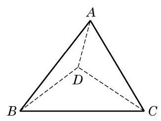
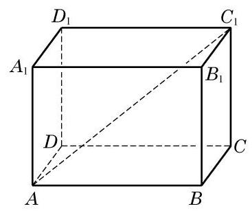
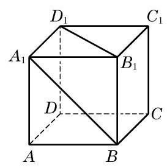

# 概念卡：习题 10.5

##### A 组

1. 已知一平面平行于两条异面直线, 一直线与两异面直线都垂直, 那么这个平面与这条直线的位置关系是 ( )

A. 平行; B. 垂直;

C. 斜交; D. 不能确定.

2. 在棱长为 $a$ 的正方体 ${ABCD} - {A}_{1}{B}_{1}{C}_{1}{D}_{1}$ 中,求:

(1) ${D}_{1}{B}_{1}$ 与 ${C}_{1}C$ 之间的距离；

(2) ${AC}$ 与 ${D}_{1}{B}_{1}$ 之间的距离.

(第 3 题)

3. 如图,在四面体 ${ABCD}$ 中,已知所有棱长都为 $a$ . 求两异面直线 ${AB}$ 与 ${CD}$ 之间的距离.

4. 在 ${60}^{ \circ  }$ 的二面角的棱上,有两个点 $A\text{ 、 }B,{AC}\text{ 、 }{BD}$ 分别是这个二面角的两个面上垂直于 ${AB}$ 的线段. 已知 ${AB} = 4\mathrm{\;{cm}},{AC} = \; 6\mathrm{\;{cm}},{BD} = 8\mathrm{\;{cm}}$ . 求 ${CD}$ 的长.

5. 若两异面直线 $a\text{ 、 }b$ 所成的角为 ${70}^{ \circ  }$ ,过空间内一点 $P$ 作与直线 $a\text{ 、 }b$ 所成角均是 ${70}^{ \circ  }$ 的直线 $l$ ,则所作直线 $l$ 的条数为( )

A. 1 ; B. 2 ;

C. 3; D. 4.

6. 如果两个平面分别垂直于两条异面直线中的一条, 求证: 这两个平面的交线与这两条异面直线的公垂线平行或重合.

##### B 组

1. 在直二面角的棱上有 $A\text{ 、 }B$ 两点, ${AC}$ 和 ${BD}$ 分别在两个面上,并且都垂直于棱 ${AB}$ . 若 ${AB} = 8\mathrm{\;{cm}},{AC} = 6\mathrm{\;{cm}},{BD} = {24}\mathrm{\;{cm}}$ ，求 ${CD}$ 的长及 ${AB}$ 和 ${CD}$ 之间的距离.

2. 如图，在长方体 ${ABCD} - {A}_{1}{B}_{1}{C}_{1}{D}_{1}$ 中， ${AB} = a,{BC} = b,{A{A}_{1}} = c$ . 求异面直线 ${B}_{1}B$ 与 $A{C}_{1}$ 之间的距离.

(第 2 题)

(第 3 题)

3. 如图,已知正方体 ${ABCD} - {A}_{1}{B}_{1}{C}_{1}{D}_{1}$ 的棱长为 1 . 求异面直线 ${A}_{1}B$ 与 ${B}_{1}{D}_{1}$ 之间的距离.
