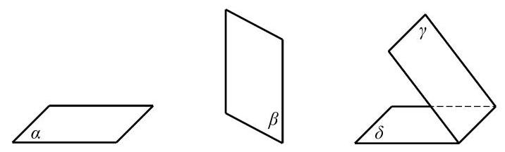
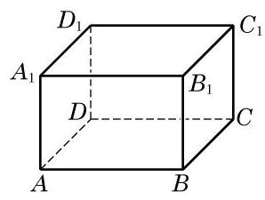

# 概念卡：1 空间的点、直线与平面

与平面几何中的点 (point) 与直线 (straight line) 一样, 平面 (plane)也是一个从实际生活中抽象出来的数学概念. 如图 10-1-1, 平静的水面、平整的墙面、太阳能反射板等都给了我们平面的形象.

平面通常用一个小写希腊字母表示，如图 10-1-2 中的平面 $\alpha \text{ 、 }\beta \text{ 、 }\gamma \text{ 、 }\delta$ 等,有时也可以用一个或多个大写英文字母表示, 如平面 $M$ 、平面 ${ABCD}$ 等. 在平面几何中我们已经知道,点是没有大小的, 直线是没有粗细并且可以无限延伸的; 类似地, 我们说, 平面是没有厚薄并且可以无限延展的.

由于平面无边无界, 因此我们不可能将一个平面完整地画在纸上, 只能画其示意图. 习惯上, 我们用一个平行四边形来表示平面. 当平面是水平放置时, 通常把这个平行四边形的锐角画成 ${45}^{ \circ  }$ 左右,且横边长约为邻边长的 2 倍. 如果一个平面被另一个平面遮挡住，应将被遮挡的部分画成虚线，以增强立体感，如图 10-1-2所示.

平面是立体几何中的一个基本图形. 长方体的每个面都是某个平面的一部分. 图 10-1-3 中,长方体 ${ABCD} - {A}_{1}{B}_{1}{C}_{1}{D}_{1}$ 就可以看作是由六个平面所围成的空间图形.

下面, 我们来讨论点、直线与平面之间的位置关系. 我们把空间的直线和平面都看成是由点所组成的集合, 这样就可以借用集合的语言和符号来表示点、直线与平面之间的关系. 为了叙述方便,我们一般用大写的英文字母 $A\text{ 、 }B\text{ 、 }C$ 等表示点,用小写的英文字母 $a\text{ 、 }b\text{ 、 }c$ 等表示直线,用小写的希腊字母 $\alpha \text{ 、 }\beta \text{ 、 }\gamma$ 等表示平面.

在空间, 点与直线、点与平面的位置关系如下:
