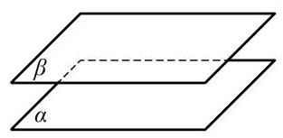
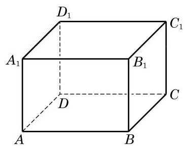

# 公理卡：公理 3 如果两个不同的平面有一个公共点, 那么它们有且只有一条过该点的公共直线.

公理 3 如果两个不同的平面有一个公共点, 那么它们有且只有一条过该点的公共直线.

根据公理 3,两个平面 $\alpha$ 和 $\beta$ 间的位置关系只有两种: 相交于一条公共直线 $l$ 或者没有公共点. 前者称为相交,记作 $\alpha  \cap  \beta  = \; l$ ; 后者称为平行,记作 $\alpha //\beta$ 或 $\alpha  \cap  \beta  = \varnothing$ .

画两个相交平面时, 通常要画出它们的交线, 如图 10-1-11 所示; 画两个平行平面时, 要使表示这两个平面的相应平行四边形的对应边平行, 如图 10-1-12 所示. 注意, 在画图时, 凡被一个平面遮住的所有线条要画成虚线.

