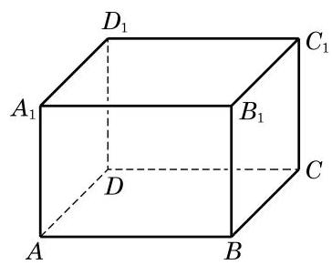

# 练习卡：练习 10.1(3)

1. 画三个平面, 使其中的两个平面互相平行, 而第三个平面与这两个平面都相交.

2. 用硬纸板作为平面的模型, 摆出三个平面两两相交各种不同的情况.

(第 3 题)

3. 如图,在长方体 ${ABCD} - {A}_{1}{B}_{1}{C}_{1}{D}_{1}$ 中,

(1)设 ${AC}$ 与 ${BD}$ 的交点为 $O$ ， $O$ 必为平面___与平面___的公共点(答案不唯一)；

(2)画出平面 ${A}_{1}{BC}{D}_{1}$ 与平面 ${B}_{1}{BD}{D}_{1}$ 的交线.
