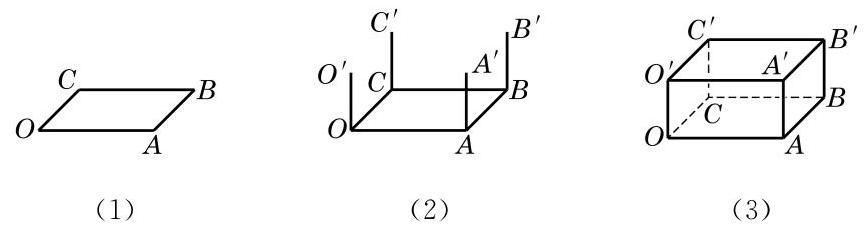

# 例题卡：例 5 用斜二测画法画长、宽、高分别为 4、3、2 的长方体的直观图.

例 5 用斜二测画法画长、宽、高分别为 4、3、2 的长方体的直观图.

画法 (1) 画底面:画 $\square {OABC}$ ，使得 ${OA} = 4,{OC} = \frac{3}{2}, \; \angle {AOC} = {45}^{ \circ  }$ ,如图 10-1-16(1) 所示.

(2)画侧棱:过 $O$ 、 $A$ 、 $B$ 、 $C$ 各点分别作 ${OA}$ 和 ${BC}$ 的垂线,在这些垂线上分别截取长为 2 的线段 $O{O}^{\prime }\text{ 、 }A{A}^{\prime }\text{ 、 }B{B}^{\prime }$ 、 $C{C}^{\prime }$ ,如图 10-1-16(2) 所示.

(3)成图:顺次连接 ${O}^{\prime }\text{ 、 }{A}^{\prime }\text{ 、 }{B}^{\prime }\text{ 、 }{C}^{\prime }$ ，并擦去辅助线，将被遮挡的部分改为虚线, 得长方体的直观图, 如图 10-1-16(3) 所示.

