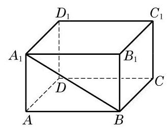
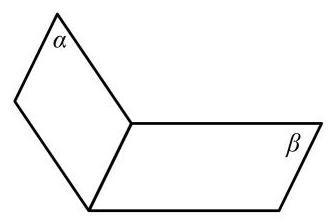
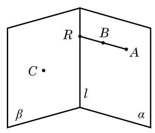
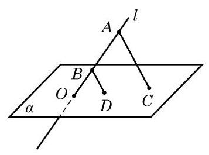
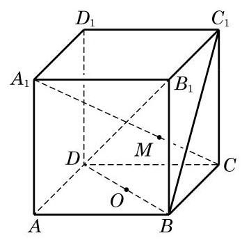
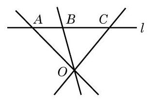
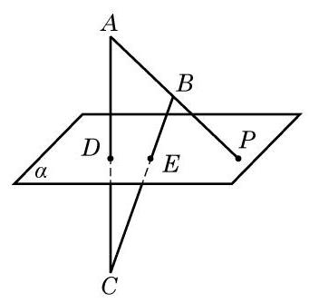
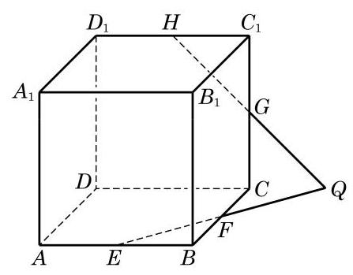

# 公理卡：习题 10.1

##### A 组

(第 1 题)

1. 如图,观察长方体 ${ABCD} - {A}_{1}{B}_{1}{C}_{1}{D}_{1}$ 中的点、线、面,用适当的符号或字母填空:

(1)点 $B$ ___直线 ${BC}$ ；

(2)点 $A$ ___直线 ${BC}$ ；

(3)点 $D$ ___平面 ${ABCD}$ ；

(4)点 ${A}_{1}$ ___平面 ${ABCD}$ ；

(5)直线 ${A}_{1}B \cap$ 直线 ${BC} =$ ___；

(6)直线 ${A}_{1}B \cap$ 平面 ${A}_{1}{B}_{1}{C}_{1}{D}_{1} =$ ___；

(7)直线 ${B}_{1}{C}_{1}$ ___平面 $B{B}_{1}{C}_{1}C$ .

(第 2 题)

2. 用集合符号表述下列语句，并将语句所描述的图形画在右图中:

(1)点 $A$ 在平面 $\alpha$ 上:___；

(2)平面 $\alpha$ 经过直线 ${AC}$ :___；

(3)点 $B$ 不在平面 $\beta$ 上:___，

(4)直线 ${BC}$ 平行于平面 $\beta$ :___.

3. 下列图形一定是平面图形吗? 请说明理由.

(1)三角形; (2)梯形； (3)四边形; (4)菱形.

4. 判断下列命题的真假:

(1)若空间四点共面，则其中必有三点共线；

(2)若空间四点中有三点共线, 则此四点必共面;

(3)若空间四点中任何三点不共线, 则此四点不共面;

(4)若空间四点不共面，则其中任意三点不共线.

5. 证明公理 2 的推论 2.

6. 平面 $\alpha$ 与平面 $\beta$ 相交于直线 $l$ ,点 $A\text{ 、 }B$ 在平面 $\alpha$ 上,点 $C$ 在平面 $\beta$ 上但不在直线 $l$ 上,直线 ${AB}$ 与直线 $l$ 相交于点 $R$ . 设 $A\text{ 、 }B\text{ 、 }C$ 三点确定的平面为 $\gamma$ ,则 $\beta$ 与 $\gamma$ 的交线是 ( )

A. 直线 ${AC}$ ; B. 直线 ${BC}$ ;

C. 直线 ${CR}$ ; D. 以上均不正确.

(第 6 题)

(第 7 题)

7. 如图,已知直线 $l$ 与平面 $\alpha$ 相交于点 $O, A\text{ 、 }B \in  l, C\text{ 、 }D \in  \alpha$ ,且 ${AC}//{BD}$ . 求证: $O\text{ 、 }C\text{ 、 }D$ 三点共线.

8. 画出棱长为 $3\mathrm{\;{cm}}$ 的正方体的直观图.

##### B 组

1.1 个平面把空间分成 2 部分，2 个平面把空间分成 3 或 4 部分，3 个平面把空间分成几部分?

2. 若平面 $\alpha$ 与平面 $\beta$ 、 $\gamma$ 都相交,则这三个平面的交线可能有几条?

A. 1 条或 2 条; B. 2 条或 3 条;

C. 1 条或 3 条; D. 1 条或 2 条或 3 条.

3. 如图,在正方体 ${ABCD} - {A}_{1}{B}_{1}{C}_{1}{D}_{1}$ 中,已知 $O$ 是 ${DB}$ 的中点,且直线 ${A}_{1}C$ 交平面 ${C}_{1}{BD}$ 于点 $M$ ，点 ${C}_{1}\text{ 、 }M\text{ 、 }O$ 的位置关系是___.

(第 3 题)

(第 4 题)

4. 如图,已知 $A \in  l, B \in  l, C \in  l, O \notin  l$ . 求证: ${OA}\text{ 、 }{OB}\text{ 、 }{OC}$ 在同一平面上.

5. 如图,已知 $D$ 及 $E$ 是 $\bigtriangleup {ABC}$ 的边 ${AC}$ 及 ${BC}$ 上的点,平面 $\alpha$ 经过 $D\text{ 、 }E$ 两点,直线 ${AB}$ 与平面 $\alpha$ 交于点 $P$ . 求证: 点 $P$ 在直线 ${DE}$ 上.

(第 5 题)

(第 6 题)

6. 如图,已知 $E\text{ 、 }F\text{ 、 }G\text{ 、 }H$ 分别是正方体 ${ABCD} - {A}_{1}{B}_{1}{C}_{1}{D}_{1}$ 的棱 ${AB}\text{ 、 }{BC}\text{ 、 }C{C}_{1}$ 、 ${C}_{1}{D}_{1}$ 的中点,且 ${EF}$ 与 ${HG}$ 相交于点 $Q$ . 求证: 点 $Q$ 在直线 ${DC}$ 上.
