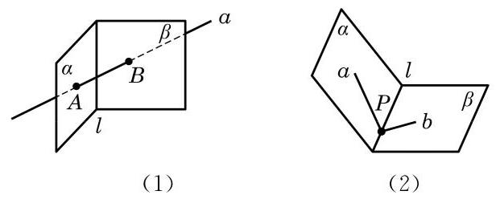

# 练习卡：练习 10.1(1)

1. 如图, 用集合语言描述下列图形中的点、直线、平面之间的位置关系.

(第 1 题)

2. 证明:若四边形有三条边在一个平面上, 则它的第四条边也在这个平面上.

我们知道两点确定一条直线, 那么在空间要确定一个平面需要几个点呢?

生活中我们都有这样的经验: 三脚架在不平的地面上也可以稳固地支撑一部照相机；两个轮子的自行车在停止运动后要加上一个支撑脚才能稳定; 一扇门尽管有两个合页固定在门框上, 但仍然可以转动, 只有锁上后才可以固定下来. 这些例子都说明了一个事实, 那就是不在同一直线上的三点才能确定一个平面. 由此, 我们得到下面的公理.
