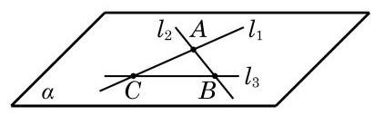

# 例题卡：例 2 已知三条直线 ${l}_{1}\text{ 、 }{l}_{2}$ 和 ${l}_{3}$ 两两相交,且不交于同一点. 求证: 直线 ${l}_{1}\text{ 、 }{l}_{2}$ 和 ${l}_{3}$ 在同一平面上.

例 2 已知三条直线 ${l}_{1}\text{ 、 }{l}_{2}$ 和 ${l}_{3}$ 两两相交,且不交于同一点. 求证: 直线 ${l}_{1}\text{ 、 }{l}_{2}$ 和 ${l}_{3}$ 在同一平面上.

证明 因为直线 ${l}_{1}\text{ 、 }{l}_{2}$ 和 ${l}_{3}$ 两两相交,设 ${l}_{1} \cap  {l}_{2} = A$ , ${l}_{2} \cap  {l}_{3} = B,{l}_{3} \cap  {l}_{1} = C$ ,如图 10-1-10 所示.

由推论 2 可知,相交的直线 ${l}_{1}$ 与 ${l}_{2}$ 可确定一个平面 $\alpha$ ,即有 ${l}_{1} \subset  \alpha ,{l}_{2} \subset  \alpha$ . 因为 $B \in  {l}_{2}, C \in  {l}_{1}$ ,所以 $B\text{ 、 }C \in  \alpha$ ,且 $B\text{ 、 }C$ 不重合. 由公理 1 可知,点 $B\text{ 、 }C$ 所在的直线 ${l}_{3} \subset  \alpha$ ,从而直线 ${l}_{1}\text{ 、 }{l}_{2}$ 和 ${l}_{3}$ 都在平面 $\alpha$ 上.
