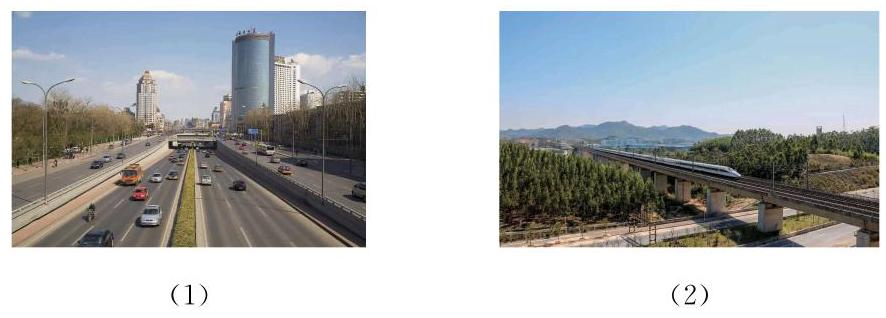
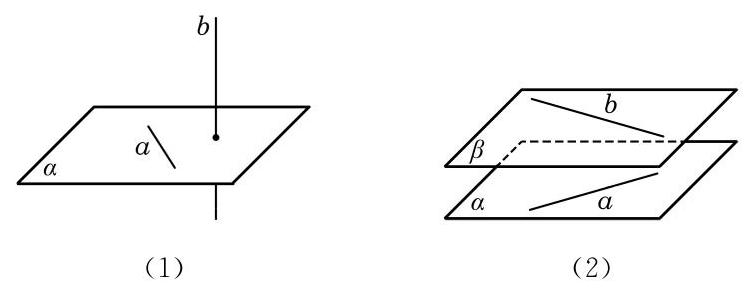
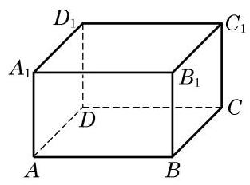

# 公理卡：2 异面直线

我们知道, 在同一平面上的两条直线只有平行或相交两种位置关系. 空间的两条直线, 除了平行和相交这两种位置关系, 是否还有其他的位置关系呢? 观察下面的两幅实景图. 在图 10-2-6(1)中，如果把远方的高楼看作是一条直线，将马路看作是另外一条直线, 这两条直线看起来既不平行, 也不相交. 类似地，在图 10-2-6(2) 中，如果把高铁轨道和其下的高速公路分别看作是两条直线, 那么它们看起来不会在同一个平面上. 我们用图10-2-7 直观地分别表示这两种实际的情景.

像上述这种不在同一个平面上, 既不相交也不平行的两条直线是空间中特有的一种两直线位置关系. 相应地，我们给出下面的定义.

定义 不同在任何一个平面上的两条直线叫做异面直线 (noncoplanar straight lines).

这里, “不同在任何一个平面上的两条直线”是指不存在一个平面, 使得这两条直线都在这个平面上. 例如, 观察图 10-2-8 中长方体 ${ABCD} - {A}_{1}{B}_{1}{C}_{1}{D}_{1}$ 的棱所在的直线,可以发现,直线 $A{A}_{1}$ 与 $C{C}_{1}$ 虽然不在这个长方体的同一个表面上,但是可以找到一个平面 (即平面 ${A}_{1}{AC}{C}_{1}$ ),使得它们都在这个平面上,所以 $A{A}_{1}$ 与 $C{C}_{1}$ 不是异面直线. 但直线 ${AB}$ 与 $C{C}_{1}$ 则不是这种情况. 假设存在一个平面 $\alpha$ 同时包含直线 ${AB}$ 与 $C{C}_{1}$ ,那么不共线的三点 $A\text{ 、 }B\text{ 、 }C$ 就在这个平面上,从而由公理 2 可知,平面 $\alpha$ 就应是长方体的下底面 ${ABCD}$ ,从而直线 $C{C}_{1}$ 就应在长方体的下底面上,但这是不可能的,所以这样的平面 $\alpha$ 是不存在的. 也就是说,直线 ${AB}$ 与 $C{C}_{1}$ 是异面直线.

这样, 空间的两条直线就有三种不同的位置关系, 可以用下表来分类:
