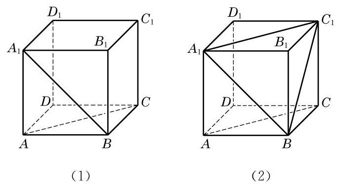

# 例题卡：例 5 如图 10-2-15(1),在正方体 ${ABCD} - {A}_{1}{B}_{1}{C}_{1}{D}_{1}$ 中,

例 5 如图 10-2-15(1),在正方体 ${ABCD} - {A}_{1}{B}_{1}{C}_{1}{D}_{1}$ 中,

(1)求异面直线 ${A}_{1}B$ 与 ${DC}$ 所成的角的大小；

(2)求异面直线 ${A}_{1}B$ 与 ${AC}$ 所成的角的大小；

(3)求证: $D{D}_{1}\bot {AB}$ .

解(1)因为 ${DC}//{AB}$ ，所以 $\angle {A}_{1}{BA}$ 就是异面直线 ${A}_{1}B$ 与 ${DC}$ 所成的角或其补角. 因为正方形 ${AB}{B}_{1}{A}_{1}$ 中, $\angle {A}_{1}{BA} = \; {45}^{ \circ  }$ ,所以异面直线 ${A}_{1}B$ 与 ${DC}$ 所成的角为 ${45}^{ \circ  }$ .

---

过空间一点, 可以作几条直线与已知直线平行? 垂直呢?

求两条异面直线所成角时, 一般通过平移将所求角置于某个三角形中, 利用三角形的边角关系来求出这个角的大小.

---

(2)如图10-2-15(2)，连接 ${A}_{1}{C}_{1}$ . 由 $A{A}_{1}{C}_{1}C$ 是平行四边形,知 ${AC}//{A}_{1}{C}_{1}$ . 连接 $B{C}_{1}$ . 在 $\bigtriangleup B{A}_{1}{C}_{1}$ 中,因为 $B{A}_{1} = \; {A}_{1}{C}_{1} = B{C}_{1} = \sqrt{2}{AB}$ ,所以 $\bigtriangleup B{A}_{1}{C}_{1}$ 是一个等边三角形,从而 $\angle B{A}_{1}{C}_{1} = {60}^{ \circ  }$ . 因为 ${AC}//{A}_{1}{C}_{1}$ ,所以 $\angle B{A}_{1}{C}_{1}$ 就是异面直线 ${A}_{1}B$ 与 ${AC}$ 所成的角. 所以,异面直线 ${A}_{1}B$ 与 ${AC}$ 所成的角为 ${60}^{ \circ  }$ .

(3)证明:因为 $D{D}_{1}//A{A}_{1}$ ，且 $A{A}_{1} \bot  {AB}$ ，所以 $D{D}_{1} \; \bot  {AB}$ .
