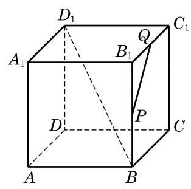

# 练习卡：练习 10.2(3)

(第 2 题)

1. 在长方体 ${ABCD} - {A}_{1}{B}_{1}{C}_{1}{D}_{1}$ 中,与棱 $A{A}_{1}$ 所在直线异面且垂直的棱有几条?

2. 在如图所示的正方体 ${ABCD} - {A}_{1}{B}_{1}{C}_{1}{D}_{1}$ 中,设 $P\text{ 、 }Q$ 分别是棱 $B{B}_{1}\text{ 、 }{B}_{1}{C}_{1}$ 的中点. 请画出异面直线 $B{D}_{1}$ 与 ${PQ}$ 所成的角.
