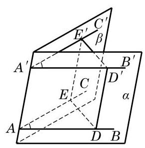

# 例题卡：例 1 中 $\angle {BAC}$ 与 $\angle {B}_{1}{A}_{1}{C}_{1}$ 的位置关系比较特殊,它们的两边分别平行且方向相同. 空间中具有这种位置关系的两个角是否一定相等呢? 我们可以证明以下定理.

例 1 中 $\angle {BAC}$ 与 $\angle {B}_{1}{A}_{1}{C}_{1}$ 的位置关系比较特殊,它们的两边分别平行且方向相同. 空间中具有这种位置关系的两个角是否一定相等呢? 我们可以证明以下定理.

等角定理 如果一个角的两边和另一个角的两边分别平行并且方向相同, 那么这两个角相等.

如图 10-2-4,已知 $\angle {BAC}$ 与 $\angle {B}^{\prime }{A}^{\prime }{C}^{\prime }$ 的边 ${AB}//{A}^{\prime }{B}^{\prime }$ , ${AC}//{A}^{\prime }{C}^{\prime }$ ,并且方向相同.

求证: $\angle {BAC} = \angle {B}^{\prime }{A}^{\prime }{C}^{\prime }$ .

证明 因为 ${AB}//{A}^{\prime }{B}^{\prime },{AC}//{A}^{\prime }{C}^{\prime }$ ，由公理 2 推论 3 可知， ${AB}\text{ 、 }{A}^{\prime }{B}^{\prime }$ 确定一个平面,记为 $\alpha ;{AC}\text{ 、 }{A}^{\prime }{C}^{\prime }$ 也确定一个平面, 记为 $\beta$ . 在直线 ${AB}\text{ 、 }{AC}$ 上分别取点 $D\text{ 、 }E$ ,在直线 ${A}^{\prime }{B}^{\prime }$ 、 ${A}^{\prime }{C}^{\prime }$ 上分别取点 ${D}^{\prime }\text{ 、 }{E}^{\prime }$ ,使得 ${AD} = {A}^{\prime }{D}^{\prime },{AE} = {A}^{\prime }{E}^{\prime }$ . 因为在平面 $\alpha$ 上， ${AD}//{A}^{\prime }{D}^{\prime },{AD} = {A}^{\prime }{D}^{\prime }$ ，所以 ${A}^{\prime }{D}^{\prime }{DA}$ 是一个平行四边形,从而 $A{A}^{\prime }//D{D}^{\prime }$ ,且 $A{A}^{\prime } = D{D}^{\prime }$ . 同理, $A{A}^{\prime }//E{E}^{\prime }$ , 且 $A{A}^{\prime } = E{E}^{\prime }$ . 这样就有 $D{D}^{\prime }//E{E}^{\prime }$ ,且 $D{D}^{\prime } = E{E}^{\prime }$ ,即 ${D}^{\prime }{E}^{\prime }{ED}$ 是一个平行四边形. 于是, ${ED} = {E}^{\prime }{D}^{\prime }$ ,从而 $\bigtriangleup {ADE} \cong \; \bigtriangleup {A}^{\prime }{D}^{\prime }{E}^{\prime }$ ,即得 $\angle {BAC} = \angle {B}^{\prime }{A}^{\prime }{C}^{\prime }$ .

---

这里我们用到了不同平面上两个全等三角形的判定与性质. 之所以可以推广这种性质到空间的情形， 是因为三角形的全等与相似都具有运动的不变性.

---

由上述定理, 我们容易得出下面两个推论.
