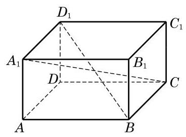
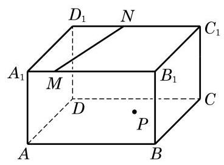
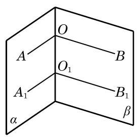

# 练习卡：练习 10.2(1)

1. 如图,在长方体 ${ABCD} - {A}_{1}{B}_{1}{C}_{1}{D}_{1}$ 中,直线 ${A}_{1}C$ 与 $B{D}_{1}$ 相交吗? 为什么?

(第 1 题)

(第 2 题)

(第 3 题)

2. 在如图所示的长方体 ${ABCD} - {A}_{1}{B}_{1}{C}_{1}{D}_{1}$ 中,平面 ${A}_{1}{B}_{1}{C}_{1}{D}_{1}$ 上有一条直线 ${MN}$ ,而平面 ${ABCD}$ 上有一点 $P$ . 试过点 $P$ 作一条直线 $l$ , 使得 $l//{MN}$ .

3. 如图，在两个相交平面 $\alpha$ 、 $\beta$ 的交线上任意取两点 $O$ 与 ${O}_{1}$ . 在平面 $\alpha$ 上,过 $O$ 与 ${O}_{1}$ 分别作射线 ${OA}$ 与 ${O}_{1}{A}_{1}$ 垂直于 $O{O}_{1}$ ; 在平面 $\beta$ 上,过 $O$ 与 ${O}_{1}$ 分别作射线 ${OB}$ 与 ${O}_{1}{B}_{1}$ 垂直于 $O{O}_{1}$ . 求证: $\angle {AOB} \; = \angle {A}_{1}{O}_{1}{B}_{1}$ .
