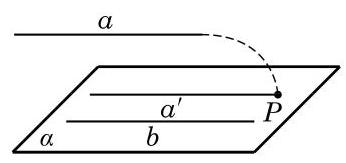
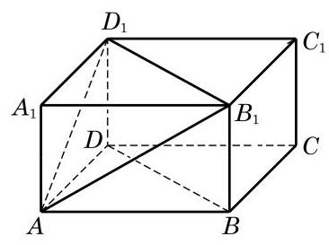

# 定理卡：1 直线与平面平行

上面我们已按照直线与平面的公共点的个数来划分了空间直线与平面的位置关系, 其中, 当直线与平面没有公共点时, 我们说直线与平面平行, 并沿用平面几何中的平行符号来表示, 如 $l//\alpha$ . 但是,因为直线与平面都是无限延伸的,要直接判断直线与平面是否有公共点往往是比较困难的, 所以我们需要一个简便的直线与平面平行的判定定理.

观察房门的转动情景可以看到，房门开启后，无论门转到什么位置, 房门外沿所在的直线始终都是和门框所在的平面平行的. 这是因为房门的外沿与内沿是平行的, 而在房门的转动过程中, 内沿始终都在门框所在的平面上. 由此可以引出下面的直线与平面平行的判定定理:

直线与平面平行的判定定理 如果不在平面上的一条直线与这个平面上的一条直线平行, 那么该直线与这个平面平行.

下面, 用反证法来证明这个定理.

已知: 如图 10-3-1,直线 $a$ 不在平面 $\alpha$ 上,直线 $b$ 在平面 $\alpha$ 上,且 $a//b$ .

求证: 直线 $a//$ 平面 $\alpha$ .

证明 假设直线 $a$ 不平行于平面 $\alpha$ ,则直线 $a$ 与平面 $\alpha$ 有公共点,设为点 $P$ . 在平面 $\alpha$ 上,过点 $P$ 作已知直线 $b$ 的平行线 ${a}^{\prime }$ . 因为 $a$ 不在 $\alpha$ 上,所以 ${a}^{\prime }$ 与 $a$ 不重合. 另一方面,因为 $a// \; b,{a}^{\prime }//b$ ,所以 ${a}^{\prime }//a$ ,这和 $a$ 与 ${a}^{\prime }$ 交于点 $P$ 矛盾. 所以原假设不成立,从而 $a//\alpha$ .

依据上述判定定理, 要判定不在平面上的一条直线与这个平面平行, 只要在此平面上找到此直线的一条平行线即可.

证明 如图 10-3-2,因为棱 $B{B}_{1}$ 平行且等于棱 $D{D}_{1}$ ,所以 $B{B}_{1}{D}_{1}D$ 是平行四边形,从而 ${BD}//{B}_{1}{D}_{1}$ . 因为直线 ${B}_{1}{D}_{1}$ 在平面 $A{B}_{1}{D}_{1}$ 上,而直线 ${BD}$ 不在平面 $A{B}_{1}{D}_{1}$ 上,由上述判定定理,得到直线 ${BD}//$ 平面 $A{B}_{1}{D}_{1}$ .

