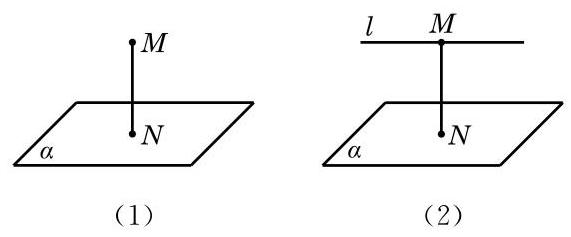
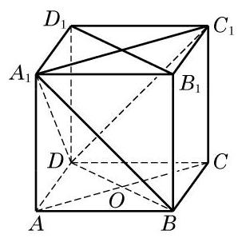

# 推论卡：推论 2 过一点有且只有一条直线与给定的平面垂直.

推论 2 过一点有且只有一条直线与给定的平面垂直.

由推论 2,如图 10-3-13 (1),过平面 $\alpha$ 外任意给定的一点 $M$ ,有且只有一条直线与平面 $\alpha$ 垂直,从而把点 $M$ 与垂足 $N$ 之间的距离叫做点 $M$ 到平面 $\alpha$ 的距离. 利用线面平行和线面垂直的性质定理可以证明,如果一条直线 $l$ 平行于一个平面 $\alpha$ ,那么直线 $l$ 上任意两点到平面 $\alpha$ 的距离都相等 (证明过程留作习题),从而就可以把直线 $l$ 上一点 $M$ 到平面 $\alpha$ 的距离定义为直线 $l$ 到与它平行的平面 $\alpha$ 的距离 (图10-3-13(2)).

