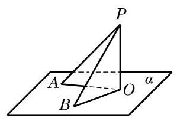
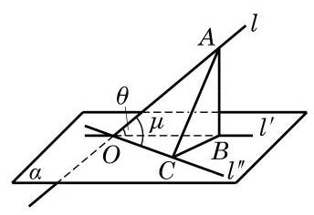

# 例题卡：例 6 证明: 从平面外一点向这个平面所引的垂线段和斜线段中,

例 6 证明: 从平面外一点向这个平面所引的垂线段和斜线段中,

(1)垂线段比任何给定的一条斜线段都短;

(2)两条斜线段相等的充要条件是它们相应的两条投影相等.

(1)因为 ${PO} \bot  \alpha$ ，由直线与平面垂直的定义，有 ${PO} \bot  {OA}$ . 由直角三角形中斜边与直角边的关系,知 ${PO} < {PA}$ ,所以垂线段比任何给定的一条斜线段都短.

证明 如图 10-3-16,记 ${PO}$ 是平面 $\alpha$ 的垂线段, ${PA}$ 和 ${PB}$ 是平面 $\alpha$ 的斜线段, ${OA}$ 和 ${OB}$ 分别是它们在平面 $\alpha$ 内的投影.

(2)先证充分性. 设 ${OA} = {OB}$ ，则直角三角形 ${PAO}$ 与直角三角形 ${PBO}$ 全等，所以 ${PA} = {PB}$ . 再证必要性. 如果 ${PA} = {PB}$ , 那么同样有 $\bigtriangleup {PAO} \cong  \bigtriangleup {PBO}$ ,所以 ${OA} = {OB}$ .

