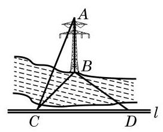

# 例题卡：例 9 如图 10-3-20,小河的一侧有一条笔直的道路 $l$ , 对岸有电塔 ${AB}$ ,已知其高为 $h$ . 现只有小平板仪 (可用于测量水平的角度) 和皮尺作为测量工具, 请说明还需测量的数据, 然后运用三垂线定理给出求电塔顶 $A$ 与道路 $l$ 的距离 $d$ 的公式.

例 9 如图 10-3-20,小河的一侧有一条笔直的道路 $l$ , 对岸有电塔 ${AB}$ ,已知其高为 $h$ . 现只有小平板仪 (可用于测量水平的角度) 和皮尺作为测量工具, 请说明还需测量的数据, 然后运用三垂线定理给出求电塔顶 $A$ 与道路 $l$ 的距离 $d$ 的公式.

解 在道路 $l$ 上取一点 $C$ ,使 ${BC} \bot  l$ ,再用小平板仪在 $l$ 上另取一点 $D$ ,使 $\angle {CDB} = {45}^{ \circ  }$ ,用皮尺测得 ${CD} = a$ .

---

选择满足 $\angle {CDB} \; = {45}^{ \circ  }$ (也可以是 ${30}^{ \circ  }$ 或 ${60}^{ \circ  }$ 的特殊角) 的点 $D$ 使解题过程最简洁, 得到的计算公式最简单. 其他的选择也可解决问题, 但过程和结果都更复杂.

---

因为 ${BC}$ 是 ${AC}$ 在地面上的投影,且 ${BC} \bot  {CD}$ ,由三垂线定理,得 ${AC} \bot  {CD}$ ,从而斜线 ${AC}$ 的长度就是电塔顶 $A$ 与道路 $l$ 的距离 $d$ .

在直角三角形 ${BCD}$ 中, $\angle {BCD} = {90}^{ \circ  },\angle {CDB} = {45}^{ \circ  },{CD} \; = a$ ,故 ${BC} = a$ . 而在直角三角形 ${ABC}$ 中,由勾股定理,得 $A{C}^{2} = A{B}^{2} + B{C}^{2}$ ,故 ${AC} = \sqrt{{h}^{2} + {a}^{2}}$ ,即电塔顶 $A$ 与道路 $l$ 的距离是

$$
d = \sqrt{{h}^{2} + {a}^{2}},
$$

其中 $h$ 是电塔的高度, $a$ 是道路 $l$ 上所取两个点 $C$ 与 $D$ 之间的距离.
