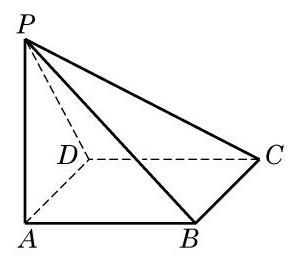

# 练习卡：练习 10.3(5)

1. 过 $\bigtriangleup {ABC}$ 所在平面 $\alpha$ 外的一点 $P$ ,作 ${PO} \bot  \alpha$ ,垂足为 $O$ ,连接 ${PA}\text{ 、 }{PB}$ 及 ${PC}$ .

(1)若 ${PA} = {PB} = {PC}$ ，则点 $O$ 是 $\bigtriangleup  {ABC}$ 的___，心；

(2)若 ${PA} = {PB} = {PC}$ ， ${\angle {ACB}} = {90}^{ \circ  }$ ，则点 $O$ 是边 ${AB}$ 的___，点；

(3)若 ${PA}\bot {PB},{PB}\bot {PC},{PC}\bot {PA}$ ，则点 $O$ 是 $\bigtriangleup  {ABC}$ 的___，心.

(第 3 题)

2. 已知 $O$ 是 $\bigtriangleup {ABC}$ 的垂心,过点 $O$ 作平面 ${ABC}$ 的垂线, $P$ 是垂线上的一点. 求证: ${PA} \bot  {BC}$ .

3. 如图,已知 ${ABCD}$ 是矩形, ${PA} \bot$ 平面 ${ABCD}$ .

(1)求证: $\angle {PBC} = {90}^{ \circ  }$ ；

(2)若 ${PC}\bot {BD}$ ，求证:四边形 ${ABCD}$ 是正方形.
