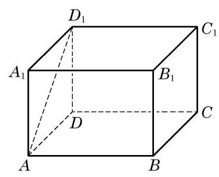
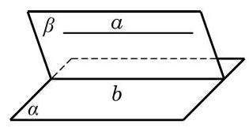
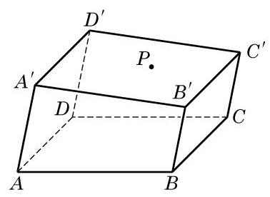

# 练习卡：练习 10.3(1)

(第 1 题)

1. 如图,在长方体 ${ABCD} - {A}_{1}{B}_{1}{C}_{1}{D}_{1}$ 的 6 个面中,

(1)与 ${AB}$ 平行的平面是___；

(2)与 $A{D}_{1}$ 平行的平面是___.

2. 判断下列命题的真假, 并说明理由:

(1)若直线 $a$ 上有无数个点不在平面 $\alpha$ 上，则 $a//\alpha$ ；

(2)若直线 $a$ 与平面 $\alpha$ 上的一条直线平行,则 $a$ 与平面 $\alpha$ 上的任意一条直线都平行;

(3)若两条平行直线中的一条平行于一个平面, 则另一条直线也平行于这个平面;

(4)设直线 $a$ 在平面 $\alpha$ 上，直线 $b$ 不在平面 $\alpha$ 上，并且 $a//b$ ，则 $b//\alpha$ .

3. 若直线 $l$ 不平行于平面 $\alpha$ ,且 $l$ 不在平面 $\alpha$ 上,判断下列结论是否成立,并说明理由:

(1)平面 $\alpha$ 上的所有直线都与 $l$ 异面;

(2)平面 $\alpha$ 上不存在与 $l$ 平行的直线；

(3)平面 $\alpha$ 上存在唯一的一条直线与 $l$ 平行;

(4)平面 $\alpha$ 上的直线都与 $l$ 相交.

如果一条直线和一个平面平行, 那么这个平面上是否一定可以找到与这条直线平行的直线呢? 有下面的定理.

直线与平面平行的性质定理 如果一条直线与一个平面平行, 过这条直线的一个平面与此平面相交, 那么其交线必与该直线平行.

如图 10-3-4,已知直线 $a$ 与平面 $\alpha$ 平行,过直线 $a$ 的一个平面 $\beta$ 与平面 $\alpha$ 相交于直线 $b$ .

求证: $a//b$ .

证明 由 $a//\alpha$ ,故 $a$ 和 $\alpha$ 没有公共点.

又因为 $b \subset  \alpha$ ,所以 $a$ 和 $b$ 没有公共点.

因为 $a$ 和 $b$ 同在平面 $\beta$ 上,且没有公共点,所以 $a//b$ .

