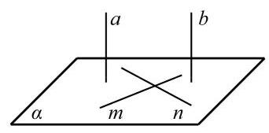
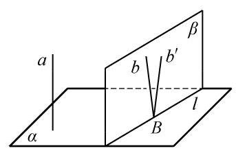

# 例题卡：例 4 证明: 如果两条平行直线 $a\text{ 、 }b$ 中的一条 $a$ 垂直于一个平面 $\alpha$ ,那么另一条 $b$ 也垂直于这个平面 $\alpha$ .

例 4 证明: 如果两条平行直线 $a\text{ 、 }b$ 中的一条 $a$ 垂直于一个平面 $\alpha$ ,那么另一条 $b$ 也垂直于这个平面 $\alpha$ .

证明 如图 10-3-11,在平面 $\alpha$ 内作两条相交直线 $m\text{ 、 }n$ . 因为 $a \bot  \alpha$ ,根据直线与平面垂直的定义,知 $a \bot  m, a \bot  n$ . 又因为 $a//b$ ,所以 $b \bot  m, b \bot  n$ . 因为 $m\text{ 、 }n$ 是平面 $\alpha$ 上的两条相交直线,所以 $b \bot$ 平面 $\alpha$ .

由例 4 可知, 如果一组平行线中的一条与一个平面垂直, 那么其他平行线也都与这个平面垂直. 我们现在考虑反过来的问题: 垂直于同一个平面的直线是否都平行呢?

答案是肯定的, 我们有下面的定理.

直线与平面垂直的性质定理 垂直于同一个平面的两条直线互相平行.

已知: $a\text{ 、 }b$ 是两条直线,且 $a \bot  \alpha , b \bot  \alpha$ (图 10-3-12).

求证: $a//b$ .

证明 用反证法. 设 $a$ 与 $b$ 不平行,直线 $b$ 与平面 $\alpha$ 的交点为 $B$ . 过点 $B$ 作直线 ${b}^{\prime }$ ,使得 ${b}^{\prime }//a$ . 由直线 $b$ 与 ${b}^{\prime }$ 确定的平面记为 $\beta$ ,设平面 $\beta$ 与平面 $\alpha$ 的交线为 $l$ . 因为 $a \bot  \alpha , b \bot  \alpha$ ,所以 $a \bot  l, b \bot  l$ ; 由 ${b}^{\prime }//a$ ,又可得出 ${b}^{\prime } \bot  l$ . 直线 $b$ 与 ${b}^{\prime }$ 都在平面 $\beta$ 上，都过点 $B$ ，且都垂直于直线 $l$ ，这与“在同一个平面上，过一点有且只有一条直线与已知直线垂直”矛盾. 由此得到 $a//b$ .

由上述线面垂直的定义和定理可以得到下面的推论:
