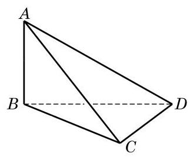

# 练习卡：练习 10.4(2)

1. 已知平面 $\alpha  \bot$ 平面 $\beta$ ,判断下列命题是否正确,并说明理由:

(1)平面 $\alpha$ 上的任意一条直线都垂直于平面 $\beta$ 上的任意一条直线；

(2)平面 $\alpha$ 上的任意一条直线都垂直于平面 $\beta$ 上的无数条直线；

(第 2 题)

(3)平面 $\alpha$ 上的任意一条直线都垂直于平面 $\beta$ ；

(4)过平面 $\alpha$ 上任意一点作平面 $\alpha$ 与 $\beta$ 交线的垂线 $l$ ，则 $l\bot \beta$ .

2. 如图,已知 ${AB} \bot$ 平面 ${BCD},{BC} \bot  {CD}$ ,有哪些平面互相垂直? 为什么?

3. 证明: 如果两个平面垂直, 那么过第一个平面上一点且垂直于第二个平面的直线, 必在第一个平面上.
