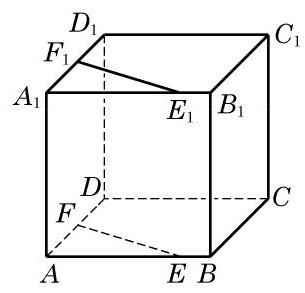
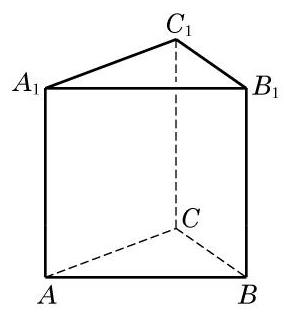
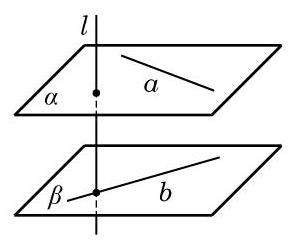
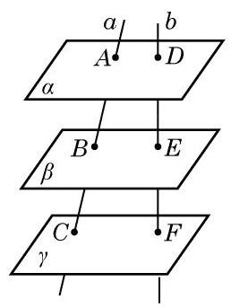
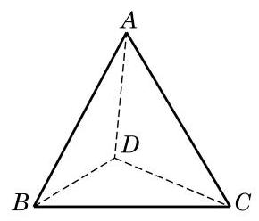
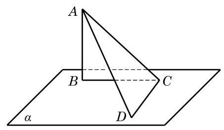
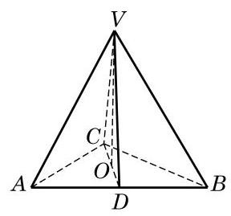

# 概念卡：习题 10.4

##### A 组

1. 判断下列命题的真假, 并说明理由:

(1)平行于同一条直线的两个平面平行;

(2)若两个平面分别经过两条平行直线，则这两个平面平行；

(3)分别在两个平行平面上的两条直线平行；

(4)与两条异面直线都平行的两个平面平行.

2. 如图,在正方体 ${ABCD} - {A}_{1}{B}_{1}{C}_{1}{D}_{1}$ 中, ${AE} = {A}_{1}{E}_{1},{AF} = {A}_{1}{F}_{1}$ . 求证: ${EF}// \; {E}_{1}{F}_{1}$ ,且 ${EF} = {E}_{1}{F}_{1}$ .

3. 如图, $A\text{ 、 }B\text{ 、 }C$ 为不共线的三点, $A{A}_{1}//B{B}_{1}//C{C}_{1}$ ,且 $A{A}_{1} = B{B}_{1} = C{C}_{1}$ . 求证: 平面 ${ABC}//$ 平面 ${A}_{1}{B}_{1}{C}_{1}$ .

(第 2 题)

(第 3 题)

4. 如图,直线 $a$ 及直线 $b$ 是异面直线,直线 $a\text{ 、 }b$ 分别在两个平行平面 $\alpha$ 和 $\beta$ 上. 又设直线 $l\bot a, l\bot b$ . 求证: $l\bot \alpha , l\bot \beta$ .

(第 4 题)

(第 5 题)

5. 如图,设 $\alpha \text{ 、 }\beta \text{ 、 }\gamma$ 三平面互相平行,直线 $a$ 与 $b$ 分别交 $\alpha \text{ 、 }\beta \text{ 、 }\gamma$ 于点 $A\text{ 、 }B\text{ 、 }C$ 和点 $D\text{ 、 }E\text{ 、 }F$ . 求证: $\frac{AB}{BC} = \frac{DE}{EF}$ .

6. 在正方体 ${ABCD} - {A}^{\prime }{B}^{\prime }{C}^{\prime }{D}^{\prime }$ 中,平面 ${AB}{C}^{\prime }{D}^{\prime }$ 与正方体的各个面所成的二面角的大小分别是多少?

7. 在 ${30}^{ \circ  }$ 二面角的一个面内有一个点,它到另一个面的距离是 ${10}\mathrm{\;{cm}}$ . 求这个点到二面角的棱的距离.

8. 如图，在四面体 ${ABCD}$ 中，已知 ${AB} = {AC} = {BD} = {CD} = 2,{BC} = 2\sqrt{3},$ 且 ${AD} = 1$ . 试作出二面角 $A - {BC} - D$ 的平面角,并求它的度数.

(第 8 题)

(第 10 题)

9. 判断下列命题的真假, 并说明理由:

(1)若平面 $\alpha  \bot$ 平面 $\beta$ ，平面 $\beta  \bot$ 平面 $\gamma$ ，则平面 $\alpha  \bot$ 平面 $\gamma$ ；

(2)若平面 $\alpha //$ 平面 ${\alpha }_{1}$ ，平面 $\beta //$ 平面 ${\beta }_{1}$ ，平面 $\alpha  \bot$ 平面 $\beta$ ，则平面 ${\alpha }_{1} \bot$ 平面 ${\beta }_{1}$ .

10. 如图,已知 ${AB}$ 是平面 $\alpha$ 的垂线, ${AC}$ 是平面 $\alpha$ 的一条斜线, ${CD}$ 在 $\alpha$ 上,且垂直于 ${AC}$ . 求证: 平面 ${ABC} \bot$ 平面 ${ACD}$ .

11. 已知平面 $\alpha \text{ 、 }\beta \text{ 、 }\gamma$ ,且 $\alpha$ 及 $\beta$ 均垂直于 $\gamma$ ,记 $\alpha$ 与 $\beta$ 的交线为 $l$ . 求证: $l$ 垂直于 $\gamma$ .

##### B 组

1. 假设 $m\text{ 、 }n$ 是两条相交直线, ${l}_{1}\text{ 、 }{l}_{2}$ 是与 $m\text{ 、 }n$ 都垂直的两条直线,但直线 $l$ 至少与 $m\text{ 、 }n$ 中的一条不垂直. 求证: 直线 $l$ 与 ${l}_{1}\text{ 、 }{l}_{2}$ 所成的角相等.

(第 2 题)

2. 如图，在四面体 ${VABC}$ 中，从顶点 $V$ 作平面 ${ABC}$ 的垂线，垂足 $O$ 恰好落在 $\bigtriangleup {ABC}$ 的中线 ${CD}$ 上. 如果 ${VA} = {VB}$ ,能否判定 ${AC} = \; {BC}$ 以及平面 ${VCD} \bot$ 平面 ${VAB}$ ?

3. 证明: 三个两两垂直的平面的相应交线也两两垂直.

4. 自二面角内一点分别向两个面作垂线, 求证: 它们所成的角与二面角的平面角相等或互补.

5. 证明: 垂直于同一条直线的两个平面平行.
