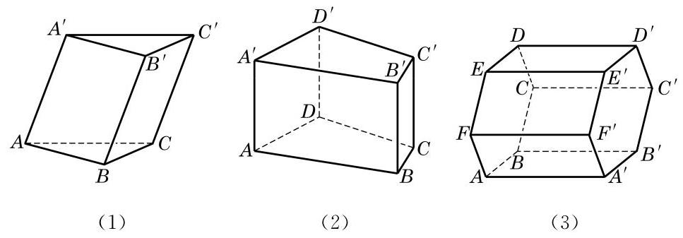

# 概念卡：1 棱柱与圆柱

在上一章学习中我们见到过的长方体、四面体等都是由若干三角形或平面多边形包围起来的几何体. 像这样由三角形或平面多边形围成的封闭几何体称为多面体 (polyhedron), 构成多面体表面的各三角形或平面多边形称为多面体的面(face), 相邻面的公共边称为多面体的棱(edge), 棱与棱的交点称为多面体的顶点(vertex).

观察图 11-1-1 中的多面体, 可以发现它们有如下的共同特征:有一对互相平行的面，且这两个面是两个全等的三角形或平面多边形; 同时, 不在这两个面上的棱都相互平行. 我们把这样的多面体叫做棱柱 (prism). 那一对互相平行的面称为棱柱的底面, 其余的面则称为棱柱的侧面, 不在底面上的棱称为棱柱的侧棱, 而棱柱的两个底面之间的距离称为棱柱的高. 侧棱垂直于底面的棱柱称为直棱柱 (right prism), 否则称为斜棱柱 (oblique prism). 底面是正多边形的直棱柱称为正棱柱 (regular prism).

通常又可按照棱柱底面的多边形的边数把棱柱分为三棱柱、 四棱柱、五棱柱等. 例如, 图 11-1-1 中, (1)是三棱柱, 又因为它的侧棱不垂直于底面，所以是斜三棱柱；(2)是四棱柱，又因为侧棱垂直于底面, 所以是直四棱柱; (3)的底面是正六边形, 侧棱又垂直于底面, 所以是正六棱柱.

---

棱柱常用表示两底面多边形的记号(顶点相应排列)再用短横连接来记. 例如, 图 11-1-1 中, 三棱柱 (1) 可记为棱柱 ${ABC} - \; {A}^{\prime }{B}^{\prime }{C}^{\prime }$ ,六棱柱 (3) 可记为棱柱 ${ABCDEF} - \; {A}^{\prime }{B}^{\prime }{C}^{\prime }{D}^{\prime }{E}^{\prime }{F}^{\prime }$ .

---
