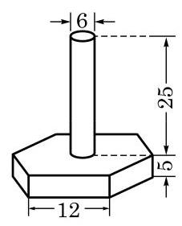

# 练习卡：练习 11.1(3)

(第 1 题)

1. 如图(图中单位:cm)是一种机器零件，零件下部是实心的直六棱柱(底面是正六边形，侧面是全等的矩形)，上部是实心的圆柱. 求此零件的体积与表面积. (结果分别精确到 ${0.1}{\mathrm{\;{cm}}}^{3}$ 与 ${0.1}{\mathrm{\;{cm}}}^{2}$ )

2. 要给一批共 10000 根相同规格的空心钢管镀锌，钢管的长度为 $1\mathrm{\;m}$ ,内外直径分别为 $8\mathrm{\;{cm}}$ 与 ${10}\mathrm{\;{cm}}$ . 若电镀这批钢管每平方米要用锌 ${0.11}\mathrm{\;{kg}}$ ,求需要用锌的总量. (结果精确到 ${0.01}\mathrm{\;{kg}}$ )

3. 证明: 表面积相等的长方体中, 正方体的体积最大.
