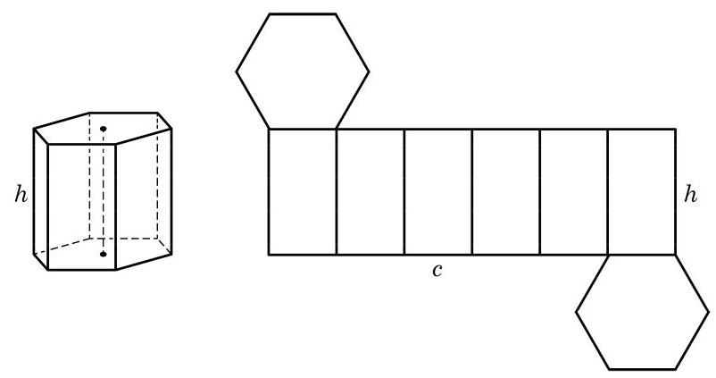
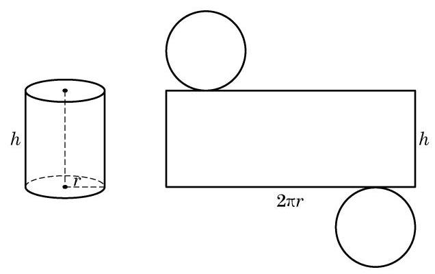

# 方法卡：3 柱体的表面积

柱体的表面由底面和侧面组成. 其中, 底面是多边形或圆. 因此, 柱体的表面积等于两个底面的面积再加上所有侧面的面积. 其中, 所有侧面的面积之和称为柱体的侧面积. 例如, 棱长分别为 $a\text{ 、 }b\text{ 、 }c$ 的长方体的表面积等于 $2\left( {{ab} + {bc} + {ca}}\right)$ .

为了计算方便, 下面我们只讨论直棱柱和圆柱的表面积.

对于直棱柱, 由定义得每个侧面都是矩形, 且每个矩形的一边都等于棱柱的高, 另一边是底面多边形的一条边. 所以, 直棱柱的侧面积等于棱柱的高乘底面多边形的周长.

我们也可以用平面展开图的方法来求直棱柱的表面积. 如图 11-1-9, 将左边的直六棱柱沿其某条棱剪开, 并展开在一个平面上，可以得到右边的平面图形.

显然, 这个平面图形的面积就是直棱柱的表面积. 其中, 所有侧面正好组成一个矩形,此矩形的一边等于棱柱的高 $h$ ,另一边等于底面多边形的周长 $c$ . 这样,我们就得到了直棱柱的表面积公式:

$$
{S}_{\text{ 直棱柱表 }} = {ch} + 2{S}_{\text{ 底 }}\text{ , }
$$

其中 ${S}_{\text{ 底 }}$ 为直棱柱的底面积.

对于圆柱, 因为侧面是一个曲面, 不能像直棱柱那样直接求面积, 但仍可以采用平面展开图的方法来求侧面积. 如图 11-1-10, 将圆柱的侧面沿某条母线剪开, 并展开在一个平面上, 同样得到一个矩形. 此矩形的一边等于圆柱的母线长 $h$ (即其高), 另一边等于底面圆的周长 $c$ . 这样,我们就得到了圆柱的表面积公式:

$$
{S}_{\text{ 圆柱表 }} = {ch} + 2{S}_{\text{ 底 }} = {2\pi rh} + {2\pi }{r}^{2},
$$

其中, ${S}_{\text{ 底 }}$ 为圆柱的底面积, $r$ 是圆柱底面的半径.

