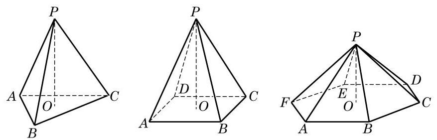

# 概念卡：1 棱锥与圆锥

观察图 11-2-2 中的图形, 可以发现它们有如下的共同特征: 有一个面是三角形或平面多边形, 且不在这个面上的棱都有一个公共点, 这样的多面体叫做棱锥 (pyramid). 其中, 这个三角形或平面多边形称为棱锥的底面, 其余的面称为棱锥的侧面, 不在底面上的棱称为棱锥的侧棱, 所有侧棱的公共点称为棱锥的顶点, 顶点到底面的距离叫做棱锥的高. 如果棱锥的底面是正多边形, 且底面中心与顶点的连线垂直于底面, 那么这个棱锥叫做正棱锥 (regular pyramid).

类比于棱柱的分类, 按照底面多边形的边数, 棱锥可以分别称为三棱锥、四棱锥、五棱锥等.
