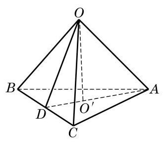

# 例题卡：例 6 已知正三棱锥 $O - {ABC}$ 的底面边长为 $2\mathrm{\;{cm}}$ ，高为 $1\mathrm{\;{cm}}$ . 求该三棱锥的表面积.

例 6 已知正三棱锥 $O - {ABC}$ 的底面边长为 $2\mathrm{\;{cm}}$ ，高为 $1\mathrm{\;{cm}}$ . 求该三棱锥的表面积.

解 如图 11-2-14,因为底面三角形 ${ABC}$ 是边长为 $2\mathrm{\;{cm}}$ 的正三角形,所以计算可得底面面积 ${S}_{\bigtriangleup {ABC}} = \sqrt{3}\left( {\mathrm{\;{cm}}}^{2}\right)$ .

设 ${O}^{\prime }$ 是正三角形 ${ABC}$ 的中心. 由正三棱锥的性质可知, $O{O}^{\prime }$ 垂直于平面 ${ABC}$ . 连接 $A{O}^{\prime }$ ,并延长交 ${BC}$ 于 $D$ ,连接 ${OD}$ . 由三垂线定理,得 ${OD} \bot  {BC}$ . 计算可得 ${AD} = \sqrt{3},{O}^{\prime }D = \frac{\sqrt{3}}{3}$ . 又 $O{O}^{\prime } = 1$ ，正三棱锥的斜高 ${OD} = \frac{2\sqrt{3}}{3}$ ，所以 ${S}_{\text{ 侧 }} = \frac{1}{2} \times  6 \times  \frac{2\sqrt{3}}{3} = \; 2\sqrt{3}\left( {\mathrm{\;{cm}}}^{2}\right)$ . 所以, ${S}_{\text{ 表 }} = \sqrt{3} + 2\sqrt{3} = 3\sqrt{3}\left( {\mathrm{\;{cm}}}^{2}\right)$ .
