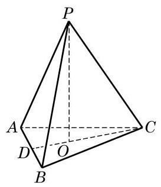
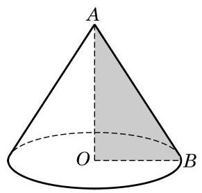
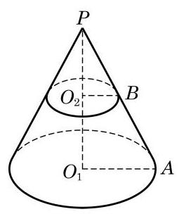

# 例题卡：例 1 证明: 在正三棱锥中, 任意两条异面的棱都相互垂直.

例 1 证明: 在正三棱锥中, 任意两条异面的棱都相互垂直.

---

棱锥常用表示其顶点的字母与表示其底面多边形的记号之间加短横来记，例如, 图 11-2-2 中, 左边的三棱锥可记为 $P - {ABC}$ ，右边的六棱锥可记为 $P - {ABCDEF}$ .

---

证明 如图 11-2-3,设 $P - {ABC}$ 是正三棱锥,从而它的底面三角形 ${ABC}$ 是正三角形,顶点 $P$ 在底面上的射影 $O$ 为 $\bigtriangleup {ABC}$ 的中心. 两条异面的棱可以 ${PC}$ 与 ${AB}$ 为代表 (其余情况完全类似),所以要证的是 ${PC} \bot  {AB}$ .

连接 ${CO}$ 并延长,与 ${AB}$ 交于点 $D$ . 因为 $O$ 为 $\bigtriangleup {ABC}$ 的中心,所以 ${CD} \bot  {AB}$ . 又因为 ${PO}$ 垂直于平面 ${ABC}$ ,所以 ${CD}$ 是 ${PC}$ 在平面 ${ABC}$ 上的射影. 由三垂线定理,知 ${PC} \bot  {AB}$ .

三棱锥由四个三角形围成, 它就是 10.2 节例 4 中出现过的四面体. 三棱锥是一种比较重要的棱锥, 因为由平面多边形围成的多面体 (见 11.3 节) 总可以看成由三棱锥拼合而成, 从而多面体的度量计算问题常常可以转化为三棱锥的问题; 而且三棱锥的每个面都可以作为棱锥的底面, 解决问题时便具有一定的灵活性.

除了棱锥, 还有一类常见的锥体就是圆锥. 如图 11-2-4, 将直角三角形 ${AOB}$ 绕其一条直角边 ${AO}$ 所在直线旋转一周,所形成的几何体叫做圆锥 (cone). 其中, ${AO}$ 所在直线叫做圆锥的轴, 点 $A$ 叫做圆锥的顶点,直角边 ${OB}$ 旋转而成的圆面叫做圆锥的底面,斜边 ${AB}$ 旋转而成的曲面叫做圆锥的侧面,斜边 ${AB}$ 叫做圆锥的母线,圆锥的顶点到底面间的距离(即 ${AO}$ 的长度) 叫做圆锥的高.

---

圆锥可用表示顶点的字母与表示底面圆心的字母之间加短横来记, 如图 11-2-4 的圆锥可记为圆锥 A-O.

---

由圆锥的形成过程可以知道, 圆锥有无穷多条母线, 且所有的母线都交于圆锥的顶点.

方便起见,我们把棱锥与圆锥统称为锥体.

