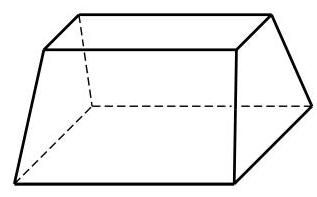

# 练习卡：练习 11.2(1)

1. 用平行于棱锥底面的平面截这个棱锥, 得到一个小棱锥. 已知这两个棱锥的高分别是 ${h}_{1}\text{ 、 }{h}_{2}$ ,求这两个棱锥的底面面积之比.

2.(1)过圆锥的任意两条母线作一个平面与圆锥相截，得到的截面是什么图形？在什么条件下, 所得到的截面面积最大?

(第 3 题)

(2)如果圆锥的母线与底面所成的角为 ${60}^{ \circ  }$ ,那么经过圆锥两条母线的平面与圆锥底面所成的二面角有可能小于 ${60}^{ \circ  }$ 吗?

3. 显然, 通过延长圆台的任意一条母线都可以使它们交于一点, 从而得到一个圆锥. 如图, 这样的几何体是否也可以通过延长棱的方法得到一个棱锥?
