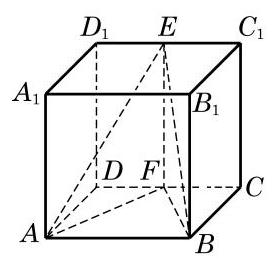
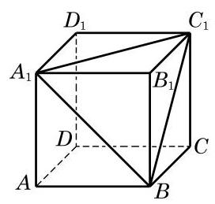

# 例题卡：例 3 如图 11-2-6,设 $E\text{ 、 }F$ 分别是给定正方体 ${ABCD} - \; {A}_{1}{B}_{1}{C}_{1}{D}_{1}$ 的棱 ${C}_{1}{D}_{1}$ 和 ${CD}$ 上的任意点. 求证: 三棱锥 $E - {ABF}$ 的体积是定值.

例 3 如图 11-2-6,设 $E\text{ 、 }F$ 分别是给定正方体 ${ABCD} - \; {A}_{1}{B}_{1}{C}_{1}{D}_{1}$ 的棱 ${C}_{1}{D}_{1}$ 和 ${CD}$ 上的任意点. 求证: 三棱锥 $E - {ABF}$ 的体积是定值.

证明 设正方体 ${ABCD} - {A}_{1}{B}_{1}{C}_{1}{D}_{1}$ 的棱长为 $a$ . 因为 ${AB}//{CD}$ ,所以当点 $F$ 在 ${CD}$ 上移动时,它与 ${AB}$ 的距离 (即 $\bigtriangleup {FAB}$ 的高)都等于 ${BC}$ ,三角形 ${FAB}$ 的面积 ${S}_{\bigtriangleup {FAB}} = \frac{1}{2}{AB} \times \; {BC} = \frac{1}{2}{a}^{2}$ 为定值.

又因为正方体的棱 ${C}_{1}{D}_{1}$ 与下底面平行,所以 ${C}_{1}{D}_{1}$ 上任意一点到下底面的距离都等于 $a$ ,所以三棱锥 $E - {ABF}$ 的体积 ${V}_{\text{ 三棱锥 }E - {ABF}} = \frac{1}{3}a{S}_{\bigtriangleup {FAB}} = \frac{1}{6}{a}^{3}$ 为定值.

由上述证明过程还可以得出,当点 $E$ 在正方体 ${ABCD} - \; {A}_{1}{B}_{1}{C}_{1}{D}_{1}$ 的上底面上任意移动时,三棱锥 $E - {ABF}$ 的体积均为定值.

