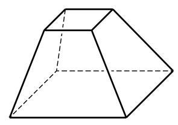

# 例题卡：例 4 如图 11-2-7,设正方体 ${ABCD} - {A}_{1}{B}_{1}{C}_{1}{D}_{1}$ 的棱长为 $a$ . 求顶点 ${B}_{1}$ 到面 $B{A}_{1}{C}_{1}$ 的距离.

例 4 如图 11-2-7,设正方体 ${ABCD} - {A}_{1}{B}_{1}{C}_{1}{D}_{1}$ 的棱长为 $a$ . 求顶点 ${B}_{1}$ 到面 $B{A}_{1}{C}_{1}$ 的距离.

解 设顶点 ${B}_{1}$ 到面 $B{A}_{1}{C}_{1}$ 的距离为 $h$ ,则 ${V}_{\text{ 三棱锥 }{B}_{1} - {A}_{1}B{C}_{1}} = \; \frac{1}{3}h{S}_{\bigtriangleup {A}_{1}B{C}_{1}} = \frac{\sqrt{3}}{6}h{a}^{2}$ . 因为

$$
{V}_{\text{ 三棱锥 }{B}_{1} - {A}_{1}B{C}_{1}} = {V}_{\text{ 三棱锥 }{A}_{1} - {B}_{1}B{C}_{1}} = \frac{1}{3}a{S}_{\bigtriangleup {B}_{1}B{C}_{1}} = \frac{1}{6}{a}^{3},
$$

所以 $\frac{\sqrt{3}}{6}h{a}^{2} = \frac{1}{6}{a}^{3}, h = \frac{\sqrt{3}}{3}a$ .

