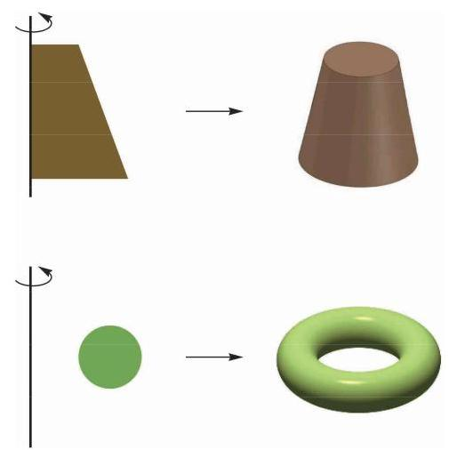
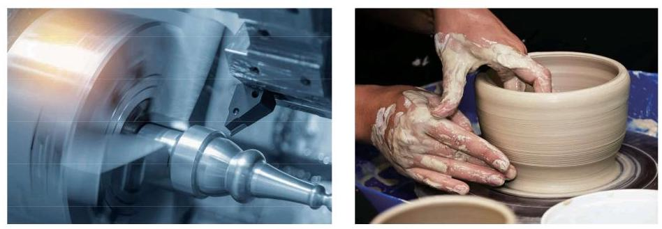
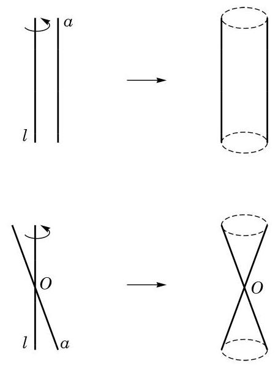

# 概念卡：2 旋转体

虽然圆柱和圆锥也是常见的几何体, 但它们具有与多面体完全不同的特征:组成这两类几何体的表面不全是平面多边形. 我们在前两节中把圆柱(圆锥)定义成由一个矩形(直角三角形)绕它的一条边 (一条直角边) 旋转一周所形成的几何体. 这里的关键词是“旋转”，由此我们抽象出一般旋转体的概念:由一个平面封闭图形绕其所在平面上的一条定直线旋转一周所形成的空间封闭几何体称为旋转体 (revolving solid) (图 11-3-2), 这条直线叫做该旋转体的轴.

在车床加工零件或陶瓷工坊制作陶器时, 我们都可以直观地体验旋转体和它的轴.

与旋转体类似地可以定义空间中的旋转面: 一条平面曲线 (包括直线、折线等)绕其所在平面上的一条直线旋转一周所形成的空间图形称为旋转面. 图 11-3-2 右边的空间几何体的表面就是旋转面, 它可由左边对应平面图形的外框线绕旋转轴旋转而得到.

旋转面是大学空间解析几何课程中的内容之一. 我们这里只关注最简单的情况: 一条直线 $a$ 绕同一平面内的另一条直线 $l$ 旋转一周所形成的曲面: 圆柱面或圆锥面. 当直线 $a$ 与直线 $l$ 平行时,得到的是圆柱面; 当直线 $a$ 与直线 $l$ 相交 (但不垂直) 时,得到的是圆锥面 (图 11-3-3). 直线 $a$ 称为圆柱面或圆锥面的母线. 在圆锥面的情况中,母线与转轴的交点 $O$ 旋转以后仍然是一个点 (仍记为 $O$ ),这个点称为圆锥面的顶点.

