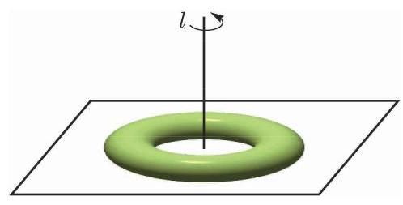

# 练习卡：练习 11.3

1. 我国古代数学著作《九章算术》中研究过一种叫“鳖 (biē) 臑(nào)”的几何体 (见《九章算术》卷第五“商功”之一六)，它指的是由四个直角三角形围成的四面体. 用你学过的立体几何知识说明这种四面体确实存在.

2. 有两个面平行, 其余各面都是平行四边形的多面体一定是柱体吗? 请给出你的理由或反例.

(第 3 题)

3. 如图是一个置于地面上的救生圈, 它是绕一条垂直于地平面的直线 $l$ 旋转而成的旋转体.

(1)如果用一个经过旋转轴 $l$ 的平面去截这个救生圈, 得到的截面是什么图形? 请画出示意图.

(2)如果用一个平行于地面的平面去截这个救生圈, 得到的截面可能是什么图形? 请画出示意图.
