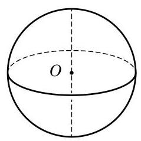
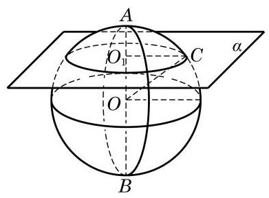

# 定理卡：1 球

和圆柱、圆锥一样, 球也是一个旋转体. 如图 11-4-2, 将圆心为 $O$ 的半圆面绕其直径所在的直线旋转一周,所形成的几何体叫做球 (ball),记作球 $O$ . 半圆的圆弧绕直径旋转所形成的旋转面叫做球面 (sphere),点 $O$ 到球面上任意一点的距离都相等, 点 $O$ 叫做球心,把原半圆的半径和直径分别叫做球的半径和直径. 与圆柱和圆锥只有一条轴不同, 球具有丰富的对称性, 所有经过球心的直线都可以作为球的旋转轴, 每条旋转轴与球面交点之间的线段都是球的直径.

假设我们用一个平面 $\alpha$ 去截球,得到的截面是什么图形呢? 如图 11-4-3,由直线与平面垂直的性质可知,过球心 $O$ 有且只有一条直线与平面 $\alpha$ 垂直. 设这条直线与球面的交点分别是 $A$ 和 $B$ ,则 ${AB}$ 是球 $O$ 的一条直径. 设平面 $\alpha$ 与 ${AB}$ 的交点是 ${O}_{1}, C$ 是平面 $\alpha$ 与球面的任意公共点. 连接 ${O}_{1}C$ . 在直角三角形 $O{O}_{1}C$ 中,由勾股定理,易知 ${O}_{1}C$ 为定值,与点 $C$ 的选取无关. 这就是说,在平面 $\alpha$ 上, $C$ 到定点 ${O}_{1}$ 的距离为定值,所以平面 $\alpha$ 与球面的交线是一个以 ${O}_{1}$ 为圆心,以 ${O}_{1}C$ 为半径的圆. 特别地, 若平面 $\alpha$ 经过球心,则 ${O}_{1}$ 与 $O$ 重合,此时的截面称为球的大圆 (great circle). 有时, 为了区分, 也把球的非大圆截面称为小圆.

