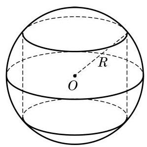

# 概念卡：B 组

1. 已知过球面上 $A\text{ 、 }B\text{ 、 }C$ 三点的截面和球心的距离等于球半径的一半,且 ${AB} = {BC} \; = {CA} = 2$ . 求截面的面积.

2. 已知三棱柱 ${ABC} - {A}_{1}{B}_{1}{C}_{1}$ 的 6 个顶点都在球 $O$ 的球面上,且 ${AB} = 3,{AC} = 4$ ， ${AB} \bot  {AC}, A{A}_{1} = {12}$ . 求球 $O$ 的半径.

3. 如图为一个用鲜花做成的花柱,它的下面是一个直径为 $1\mathrm{\;m}$ 、高为 $3\mathrm{\;m}$ 的圆柱形物体, 上面是一个半球形体. 如果每平方米大约需要鲜花 120 朵, 那么装饰这个花柱大约需要多少朵鲜花?

(第 3 题)

(第 4 题)

4. 如图,半径为 $R$ 的球 $O$ 中有一内接圆柱,当圆柱的侧面积最大时,求球的表面积与该圆柱的侧面积之差.
