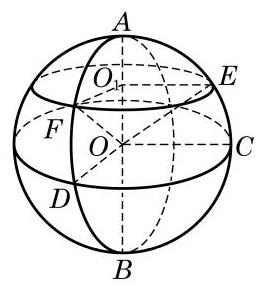
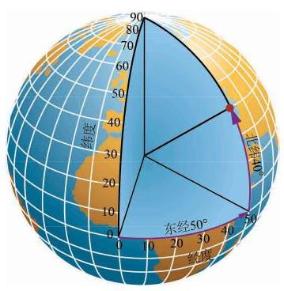

# 例题卡：例 2 如图 11-4-4,设 ${AB}$ 是球 $O$ 的一条直径,过球心 $O$ 作一个大圆 ${ODC}$ 与 ${AB}$ 垂直,过直径 ${AB}$ 上不同于点 $O$ 的任一点 ${O}_{1}$ 作与 ${AB}$ 垂直的平面,与球 $O$ 交于小圆 ${O}_{1}$ ,过直径 ${AB}$ 作两个平面与球分别交于两个大圆 ${OEC}$ 和 ${OFD}, E$ 和 $F$ 分别是这两个大圆的圆周与圆 ${O}_{1}$ 的交点. 求证:

例 2 如图 11-4-4,设 ${AB}$ 是球 $O$ 的一条直径,过球心 $O$ 作一个大圆 ${ODC}$ 与 ${AB}$ 垂直,过直径 ${AB}$ 上不同于点 $O$ 的任一点 ${O}_{1}$ 作与 ${AB}$ 垂直的平面,与球 $O$ 交于小圆 ${O}_{1}$ ,过直径 ${AB}$ 作两个平面与球分别交于两个大圆 ${OEC}$ 和 ${OFD}, E$ 和 $F$ 分别是这两个大圆的圆周与圆 ${O}_{1}$ 的交点. 求证:

(1) $\angle {DOC}\text{ 、 }\angle {F{O}_{1}E}$ 都是二面角 $D - {AB} - C$ 的平面角；

(2) ${OE}$ 和 ${OF}$ 与平面 ${ODC}$ 所成的角相等.

---

当以一点为圆心的圆不只一个时, 可以用表示圆心的字母后面跟着表示圆周上不在一条直径上的两个点的字母来表示所指的圆, 如本题的圆 ${ODC}$ . 这样的三点完全决定了圆所在的平面以及在平面上圆心位置和圆的大小.

---

证明(1)由题设，大圆 ${ODC}$ 及小圆 ${O}_{1}$ 所在平面都垂直于 ${AB}$ ,所以 ${O}_{1}F \bot  {AB},{O}_{1}E \bot  {AB},{OD} \bot  {AB},{OC} \bot  {AB}$ ,即 $\angle {DOC}\text{ 、 }\angle F{O}_{1}E$ 都是二面角 $D - {AB} - C$ 的平面角.

(2)因为平面 ${OEC}$ 和平面 ${OFD}$ 都经过直线 ${AB}$ ，而直线 ${AB}$ 垂直于平面 ${ODC}$ ,由平面与平面垂直的判定定理,知平面 ${OEC}$ 和平面 ${OFD}$ 都垂直于平面 ${ODC}$ ,所以直线 ${OC}$ 和 ${OD}$ 分别是斜线 ${OE}$ 和 ${OF}$ 在平面 ${ODC}$ 上的射影,即 $\angle {EOC}\text{ 、 }\angle {FOD}$ 分别是斜线 ${OE}$ 和 ${OF}$ 与平面 ${ODC}$ 所成的角. 因为 ${OE} = {OF}$ , ${O}_{1}E = {O}_{1}F, O{O}_{1}$ 是公共边,所以 $\bigtriangleup {OF}{O}_{1} \cong  \bigtriangleup {OE}{O}_{1}$ ,所以 $\angle {EO}{O}_{1} = \angle {FO}{O}_{1}$ . 由此得 $\angle {EOC} = \angle {FOD}$ ,即 ${OE}$ 和 ${OF}$ 与平面 ${ODC}$ 所成的角相等.

由例 2, 我们可以对地球的经纬度进行数学解释. 首先我们把地球看作是一个球体. 如图 11-4-4,设直径 ${AB}$ 的端点分别是地球的北极点和南极点,大圆 ${ODC}$ 是赤道所在的平面. 用平行于赤道平面的平面截地球得到的小圆 (如圆 ${O}_{1}$ ) 的圆周称为纬线, 按照南北方向分为南纬和北纬. 过 ${AB}$ 的大圆的半圆周 (如半圆 AFDB)称为经线. 按照约定, 通过英国伦敦格林尼治天文台原址的那条经线称为 0 度经线，从它开始，分别按照东西方向分为东经和西经. 地球上某点的纬度是该点和地心连线与赤道平面所成的角. 由例 2 , 知同一条纬线上的点的纬度都相同; 该点的经度是它所在的经线半圆与 0 度经线半圆所成二面角的度数. 例如,图 11-4-5 中,红点的方位就是 (东经 ${50}^{ \circ  }$ ,北纬 ${40}^{ \circ  }$ ).

