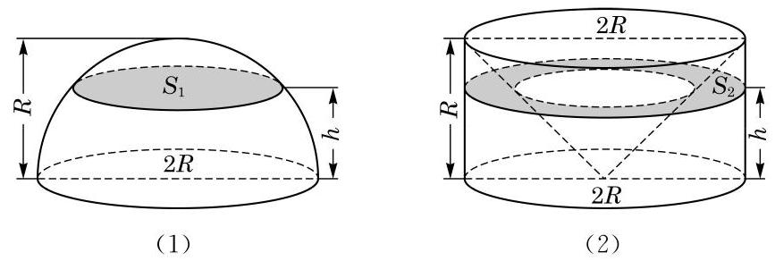

# 公式卡：2 球的体积

设有一个半径为 $R$ 的球. 和柱体、锥体一样,我们也可以应用祖暅原理推导球的体积公式. 我们先只考虑半球, 即由球的一个大圆把球切成两部分中的一部分(图 11-4-6(1)). 作为对比的几何体,我们取底面半径为 $R$ 、高为 $R$ 的圆柱,并从中切去一个倒置的底面半径为 $R$ 、高为 $R$ 的圆锥 (圆锥的底面置于圆柱的上底面，圆锥的顶点置于圆柱下底面的圆心) (图 11-4-6(2)).

用平行于底面高度为 $h$ 的平面截这两个几何体. 半球在大圆截口上方高度 $h$ 处的截面是半径为 $\sqrt{{R}^{2} - {h}^{2}}$ 的圆,所以它的面积是 $\pi \left( {{R}^{2} - {h}^{2}}\right)$ ; 容易看出右边几何体中被切掉的圆锥在高度 $h$ 上的截面的半径是 $h$ ,所以右边几何体在高度 $h$ 上的截面面积是 $\pi {R}^{2} - \pi {h}^{2} = \pi \left( {{R}^{2} - {h}^{2}}\right)$ . 这两个截面面积相等,根据祖暅原理, 这两个几何体的体积相等, 即半球的体积为图 11-4-6(2) 中圆柱体积减去圆锥体积 $\pi {R}^{3} - \frac{1}{3}\pi {R}^{3} = \frac{2}{3}\pi {R}^{3}$ .

由此可见, 球的体积是

$$
{V}_{\text{ 球 }} = \frac{4}{3}\pi {R}^{3}.
$$
