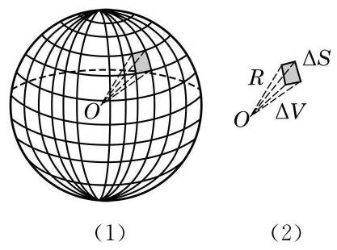
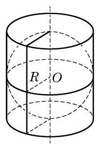

# 公式卡：3 球的表面积

球的表面积就是球面的面积. 由球的定义可以看出, 球面是由一条半圆弧绕其直径旋转一周而成的曲面, 它不能像圆柱面、 圆锥面那样展开为平面图, 求它的面积就不能化为平面的问题.

实际上, 球面面积公式的严格推导或证明需要用到极限与微积分等工具, 本教材中无法完整给出. 作为替代, 本小节给出球面面积公式, 并描述一种证明的思路, 等同学们学了更多数学知识后, 就有可能对这种思路有更深的理解, 甚至可以自己把它补成严格的数学证明.

以 $R$ 为半径的球面面积是

$$
{S}_{\text{ 球 }} = {4\pi }{R}^{2}.
$$

如图 11-4-7(1)所示，把球面剖分成许多小区域. 取其中一个区域, 把它近似地看成平面的三角形或多边形, 从而它与球心组成了一个侧棱是 $R$ 的棱锥,当这个区域足够小时,棱锥的高也近似于 $R$ ,棱锥的体积 ${\Delta V} \approx  \frac{1}{3}{R\Delta S}$ ,其中 ${\Delta S}$ 为棱锥底面积 (图 11-4-7(2)). 当取遍剖分中的所有小区域时, ${\Delta S}$ 的总和近似于球面的面积 ${S}_{\text{ 球 }}$ ,而 ${\Delta V}$ 的总和近似于球的体积 ${V}_{\text{ 球 }}$ ,于是我们得到球面面积与球的体积之间的关系

$$
{V}_{\text{ 球 }} \approx  \frac{1}{3}R{S}_{\text{ 球. }}
$$

这个关系式与剖分过程无关. 可以想象, 当剖分做得越来越精细时, 推导过程中的“近似”越来越趋向于“精确”, 于是上述近似关系最终成为相等关系, 再把球的体积公式代入, 得到

$$
\frac{4}{3}\pi {R}^{3} = \frac{1}{3}R{S}_{\text{ 球 }},
$$

整理即得球面面积公式.

