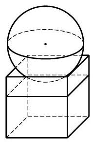

# 练习卡：练习 11.4(2)

(第 3 题)

1. 已知地球的半径约为 ${6371}\mathrm{\;{km}}$ ,计算地球的表面积. (结果精确到 ${10000}{\mathrm{\;{km}}}^{2}$ )

2. 把一个半径为 $R$ 的实心铁球熔化铸成两个小球,两个小球的半径之比为1 :2. 求其中较小球的半径.

3. 如图,有一个水平放置的透明无盖的正方体容器,容器高 $8\mathrm{\;{cm}}$ ,将一个球放在容器口, 再向容器注水, 当球面恰好接触水面时, 测得水深为 $6\mathrm{\;{cm}}$ . 若不计容器的厚度,求球的体积.
