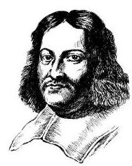
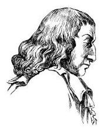

# 方法卡：1 随机现象

概率是描述一个随机现象中某事件发生的可能性 (或者机会)大小的一种度量. 要理解概率，首先要理解随机现象或者随机性.

现实世界有具确定性的现象, 对其可以预见确切的结果, 但更多的是具不确定性的现象, 也就是无法预知确切结果的现象. 如俗语说:天有不测风云，人有旦夕祸福，许多事情人们无法预知, 更无法掌控. 具不确定性的现象也称为随机现象 (random phenomenon), 或者说具有随机性.

先看几个生活中常见的例子:

1. 向上抛掷一枚硬币. 能够确定的是, 因为重力的作用, 它必定会落在地面上. 但是究竟哪一面朝上, 却是无法预知的.

2. 在车流不大的高速公路上, $A\text{ 、 }B$ 两地相距 ${100}\mathrm{\;{km}}$ . 上午 8 时从 $A$ 地出发,以 ${100}\mathrm{\;{km}}/\mathrm{h}$ 的速度去往 $B$ 地,那么我们可以肯定地说, 上午 9 时可以到达. 但如果上午 8 时从上海人民广场出发去上海浦东国际机场，由于市内堵车，我们很难准确预测什么时间可以到达.

3. 如果将 1 万元存到某银行，年利率为 3%，那么一年后的利息收入必是 300 元. 但如果将此 1 万元买该银行的股票，那么一年后的收益却是不确定的.

4. 人随着年龄增长慢慢变老, 这是确定无疑的. 但是观察 60 岁左右的人，会发现其衰老的程度很不一样，呈现出随机性.

由于随机性的存在, 我们无法准确地预测在一个随机现象中会出现什么样的结果, 然而, 对于随机现象, 我们是不是完全束手无策了呢? 答案是否定的. 尽管我们无法确切预测到结果, 但对出现某一结果的可能性大小还是有预期的, 而且通常可以得到其估计值. 例如, 抛掷一枚硬币, 人们对于可能出现的两种状态有相同的期待,也就是说两个面各自出现的可能性都是 $\frac{1}{2}$ ; 如果多次抛掷硬币, 人们会期待两个面出现的次数应该是差不多的. 又如, 我们虽然不能确切地知道明天是否会下雨, 但是借助气象研究, 气象台可以通过公布降雨概率, 对明天下雨的可能性大小作出预期, 供公众参考. 这说明, 人们相信随机现象中还是存在某种规律的, 找出这种规律就是概率论所要研究的目标.

---

概率描述随机现象中某些结果出现的可能性大小.

费马 (P. de Fermat, 1601-1665), 法国数学家，正式职业是律师. 费马与帕斯卡在 1654 年 7-10 月有 7 封关于分奖金问题的书信来往, 开启了概率论的研究.

帕斯卡 (B. Pascal, 1623 —1662), 法国数学家、 物理学家.

---

现实中有很多不同类型的随机现象. 简单分为可随意重复的, 如抛掷硬币、掷骰子、抽签等, 称为随机试验; 与不可随意重复的, 如天气、动物寿命等. 它们的研究方法也不尽相同. 概率论是由研究随机性而发展起来的一个数学分支, 它起源于 1654 年两位法国数学家费马和帕斯卡对赌徒提出的分奖金问题的通信讨论. 该分奖金问题可叙述如下:

$A\text{ 、 }B$ 两人下棋,每局两人获胜的可能性一样. 某一天两人要进行一场三局两胜的比赛, 最终胜者赢得 100 元奖金. 第一局比赛 $A$ 胜,后因为有其他要事而中止比赛. 问: 怎么分 100 元奖金才公平?

尽管 $A$ 胜了第一局,但结果依然是不确定的, $A\text{ 、 }B$ 都有胜的机会. 但因为 $A$ 已胜一局,所以如果比赛继续下去, $A$ 胜的可能性更大. 因此, 按照最终取胜的可能性大小 (也就是概率) 比例进行分配是大家认可的一个公平分配方案, 从而问题归结于如何计算 $A\text{ 、 }B$ 各自取胜的概率.

历史上很多人考虑过这个问题，包括费马、帕斯卡、惠更斯 (C. Huygens)等, 他们从不同的角度得到了同样的答案, 说明该问题背后有着某种规律. 这些规律引起了数学家的兴趣, 由此开启了对概率论的研究.

现在, 你也来想一想, 看能否像 300 多年前的数学家那样运用对概率的直觉来回答这个问题. 等学完这一章, 我们再来解答这个问题.
