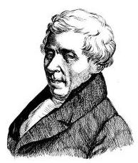

# 概念卡：1 等可能性与概率

通俗地讲，概率就是可能性的大小. 我们从最简单的抛掷硬币来学习与概率相关的概念. 抛掷一枚硬币这个随机试验一共有两个可能的结果: 正面朝上与反面朝上, 其中必然有且只有一个结果会出现, 并且两个结果出现的可能性通常被认为是一样的. 因为习惯地约定必然事件的概率是 1 , 所以正面朝上的可能性即概率是 $\frac{1}{2}$ . 这里的关键是硬币的两个面出现的可能性一样. 一般地, 若一个随机试验的所有结果出现的可能性都一样, 则称之为具有等可能性 (equally likely), 它在许多场合下是直观自然的.

如果一个随机试验满足下面两个条件:(1)包含有限个可能出现的结果(基本事件)；(2)这些结果出现是等可能的，那么这样的随机试验就称为古典概率模型. 它是最常见也是最简单的概率模型.

在一个古典概率模型中, $\Omega$ 是一个有限且等可能的样本空间. 这里等可能的样本空间是指该样本空间中的每个基本事件出现的可能性相同. 因为依照习惯约定必然事件的概率是 1 , 所以每个基本事件发生的概率自然是基本事件总数的倒数. 由于一般的随机事件 $A$ 是基本事件的某个集合,即样本空间的一个子集, 用符号 $P\left( A\right)$ 表示事件 $A$ 发生的概率 (probability),那么事件 $A$ 发生的概率为

$$
P\left( A\right)  = \frac{\left| A\right| }{\left| \Omega \right| }.
$$

其中, $\left| A\right|$ 表示事件 $A$ 中的基本事件个数,而 $\left| \Omega \right|$ 表示样本空间中的基本事件个数. 上式说明概率是事件中的元素个数与样本空间中元素个数的比值.

---

为什么硬币的两面出现是等可能的? 这是由于: (1)假设抛掷的硬币是质地均匀的; (2)假设抛掷的过程是充分随机的. 这两个假设使得我们确信硬币落地时不会偏向于其任何一面.

符号 $\left| A\right|$ 表示集合 $A$ 的元素个数.

---

