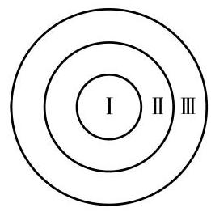

# 概念卡：习题 12.2

##### A 组

1. 从 1、2、3、4、5 中任取 3 个不同的数，求这 3 个数构成一组勾股数(或者说恰为一个直角三角形的三条边长) 的概率.

2. 如果将一枚质地均匀的硬币连续抛掷 100 次, 那么第 99 次出现反面朝上的概率是 ( )

A. $\frac{1}{100}$ ; B. $\frac{99}{100}$ ; C. $\frac{1}{99}$ ; D. $\frac{1}{2}$ .

3. 在分别写有数字0、1、2、3、4、5、6、7、8、9 的 10 张一样的卡片中随机抽取 1 张. 设事件 $A$ : 出现奇数,事件 $B$ : 出现偶数,事件 $C$ : 大于 4 . 写出下列事件对应的集合:

(1) $A$ 、 $C$ 同时发生； (2) $B$ 、 $C$ 至少有一个发生;

(3)A、B 同时发生.

4. 掷一颗骰子,设事件 $A$ : 落地时向上的点数是奇数,事件 $B$ : 落地时向上的点数是偶数,事件 $C$ : 落地时向上的点数是 3 的倍数,事件 $D$ : 落地时向上的点数是 4 . 则下列每对事件中，不是互斥事件的为 ( )

A. $A$ 与 $B$ ； B. $B$ 与 $C$ ； C. $A$ 与 $D$ ; D. $C$ 与 $D$ .

(第 5 题)

5. 如图, 靶子由一个中心圆面 I 和两个与 I 同心的圆环 II、III 构成, 射手命中 I 、II 及 III 的概率分别为 0.35、0.30 及 0.25 . 求不命中靶的概率.

6. 盒子里装有大小与质地相同的红球与白球, 从中任取 3 个球. 设事件 $A$ 表示"3 个球中有 1 个红球、 2 个白球",事件 $B$ 表示"3 个球中有 2 个红球、 1 个白球". 已知 $P\left( A\right)  = \frac{3}{10}, P\left( B\right)  = \frac{1}{2}$ . 求"3 个球中既有红球又有白球"的概率.

##### B 组

1. 已知 4 张奖券中只有 1 张能中奖，现分别由 4 名学生依次抽取(抽出后不放回)，他们的中奖概率是否一样? 为什么?

2. 已知 5 件产品中有 2 件次品、3 件合格品, 从这 5 件产品中任取 2 件, 求:

(1)恰有 1 件次品的概率; (2)2 件都是合格品的概率.

3. 已知关于 $x$ 的一元二次方程 ${x}^{2} - {ax} + 3 = 0$ ，其中 $a$ 是掷一颗骰子得到的点数. 求下列事件的概率:

(1)方程有两个不相等的实根； (2) $x = 3$ 是方程的根；

(3) 方程存在正根.

4. 已知事件 $A$ 与 $B$ 互斥,它们都不发生的概率为 $\frac{2}{5}$ ,且 $P\left( A\right)  = {2P}\left( B\right)$ . 求 $P\left( \bar{A}\right)$ .

5. 袋中有大小与质地相同的 12 个小球, 分别为红球、黑球、黄球、绿球, 从中任取 1 个球,得到红球的概率是 $\frac{1}{3}$ ,得到黑球或黄球的概率是 $\frac{5}{12}$ ,得到黄球或绿球的概率是 $\frac{5}{12}$ . 试求得到黑球、黄球、绿球的概率各是多少.
